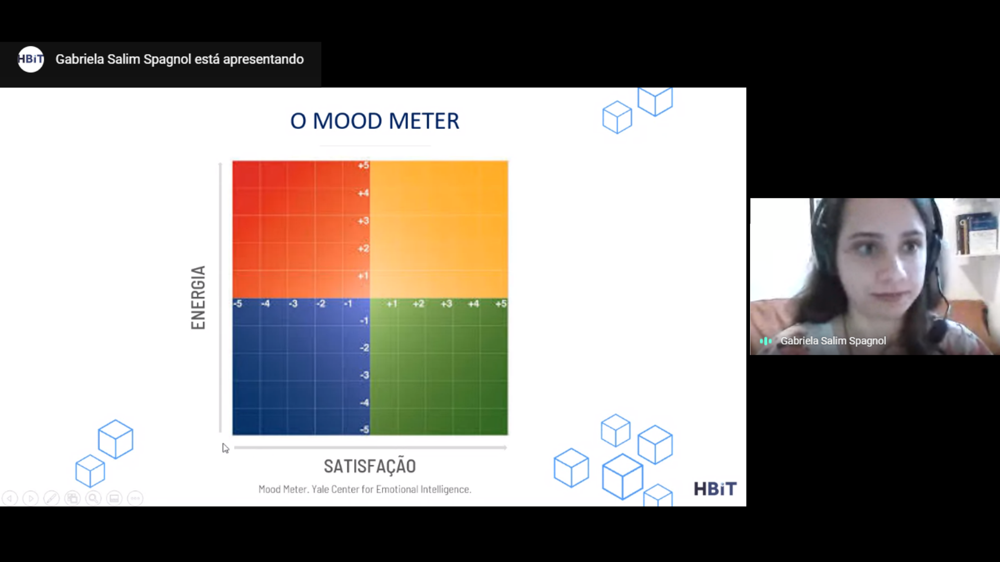

Com o atual cenário no país, gestores tiveram que reinventar a forma de trabalhar e se adaptar ao home office. Algumas empresas já ofereciam o benefício como parte da cultura da empresa - como sempre foi aqui na **HealthBit**, enquanto outras se sentiram obrigadas a se adaptar ao novo estilo de trabalho remoto. Mas agora, sem a opção de encontros semanais ou diários no escritório e com o país em quarentena, com [recomendações da OMS](https://www.who.int/emergencies/diseases/novel-coronavirus-2019/advice-for-public) para ficar em casa, qual é a saída para motivar a equipe?

Esse dilema é o que vem tirado o sono dos gestores brasileiros, como mostra [uma pesquisa realizada com 387 profissionais](https://valor.globo.com/carreira/noticia/2020/06/16/manter-equipe-motivada-e-o-maior-desafio-dos-gestores-brasileiros.ghtml). **A maior dificuldade que eles encontram durante a pandemia e o trabalho remoto é manter a equipe motivada**, além da falta de proximidade física. Eles também relataram dificuldades em controlar e manter a qualidade das entregas e garantir o cumprimento da carga horária correta.

## 5 dicas para motivar sua equipe, mesmo em isolamento físico

### Confiança
O primeiro passo é um dos mais importantes: confiar! Parece simples, mas muitos gestores ainda sofrem com essa falta de confiança em um colaborador. Se esse funcionário passou no processo seletivo e é qualificado para o cargo, apenas confie e o trate como um adulto responsável. Mas vale lembrar que a confiança tem que ser mútua, então mostre para seu colaborador que ele também pode confiar nas lideranças do time.

Um estudo da [PayScale](https://www.payscale.com/) revelou que quanto mais os funcionários sentem a confiança, mais felizes são e menos propensos a procurar um novo emprego, como mostra [essa reportagem da Business News Daily](https://www.businessnewsdaily.com/9507-employee-trust-benefits.html).

Criar uma política de portas abertas, na qual os funcionários possam se comunicar com você sobre suas preocupações, sem nenhum medo de julgamento ou retribuição e dar a liberdade dos funcionários opinarem e tomar ações proativas e decisões podem ajudar nesse novo relacionamento de confiança.

### Reuniões mais interativas
As reuniões remoto podem ser mais difíceis de conduzir porque nem sempre é possível fazer o contato visual, mas mesmo assim é possível tornar as reuniões mais interativas. É claro que gestores e líderes podem incentivar as pessoas a abrirem as câmeras mas não deve ser algo obrigatório. Por mais que fique uma reunião mais pessoal, isso pode causar desconforto para o colaborador.

Então, para a reunião ficar mais interativa e não causar desconfortos, a ideia é que seja incentivado que os funcionários dividam as opiniões e sugestões. Assim, eles se sentem parte de uma equipe e que estão fazendo a diferença na empresa, minimizando os efeitos do isolamento.

Workshops
Os workshops entraram no gosto de trabalhadores há muito tempo e as pessoas sempre estão em busca de aperfeiçoamento, seja de um assunto profissional ou até mesmo pessoal. Para ajudar a motivar a equipe, mesmo em isolamento físico, uma boa alternativa é oferecer diversos workshops.

Na **HealthBit**, os workshops acontecem geralmente às sextas-feira através da plataforma [Google Meet](https://meet.google.com/) (antes da quarentena eram presenciais). Os assuntos são diversos e variam com temas que podem agregar na vida pessoal do colaborador, também. Por aqui é incentivado que qualquer um pode elaborar um conteúdo e apresentar e a aderência é quase 100%.

Após a apresentação, todos são convidados a debater o assunto, tirar dúvidas e fazer comentários. Alguns assuntos que já foram abordados na **HealthBit** foram: Comunicação Não Violenta, Inteligência Emocional, LGPD e Saúde, Excel e Empoderamento da Mulher.

### Coffee break
Na rotina presencial em escritório, automaticamente, as pessoas conversam sobre assuntos paralelos ao do trabalho, compartilham novidades e fazem uma pausa para um café da tarde… Então por que não oferecer esta mesma dinâmica de forma digital?

Semanalmente o time pode fazer encontros para “bater papo” e dividir como tem sido essa nova rotina de trabalho e estilo de vida. Para equipes com muitas pessoas, uma boa sugestão é fazer sorteio para montar grupos de conversa.

É claro que para ser um momento gostoso é importante que seja um convite e não uma atividade obrigatória e que as conversas aconteçam sem julgamentos.

### Meditação e saúde mental
Não é novidade para ninguém que a **HealthBit** preza muito pela qualidade de vida e o cuidado com a saúde mental de toda a equipe. Já compartilhamos aqui no blog [como a HBit está cuidando da saúde mental dos colaboradores durante a pandemia](https://blog.healthbit.com.br/pandemia-como-a-HealthBit-esta-cuidando-da-saude-mental-dos-funcionarios) e também já demos boas [razões para incluir a meditação na rotina de trabalho](https://blog.healthbit.com.br/4-razoes-meditacao).

Corpo e mente de uma pessoa precisam estar em harmonia para que outras áreas da vida também estejam. Cuidar da saúde mental do seu funcionário é um investimento e também uma boa forma de motivar a equipe mesmo trabalhando remotamente. Além disso, outros benefícios agregam como redução de estresse, concentração e produtividade.

Vale lembrar que as dicas para motivar um funcionário durante a quarentena e o home office também podem ser utilizadas, com algumas adaptações, na rotina presencial. Estamos vivendo um período atípico e logo essa situação vai passar e sairemos mais forte do que entramos, com mais experiências e habilidades.

Não deixe de acompanhar o **#BlogHBit** para mais dicas e novidades de Gestão de Saúde, Gestão de RH e Saúde do Trabalhador.