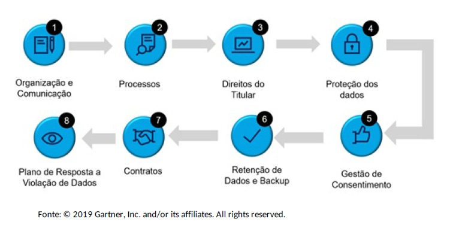
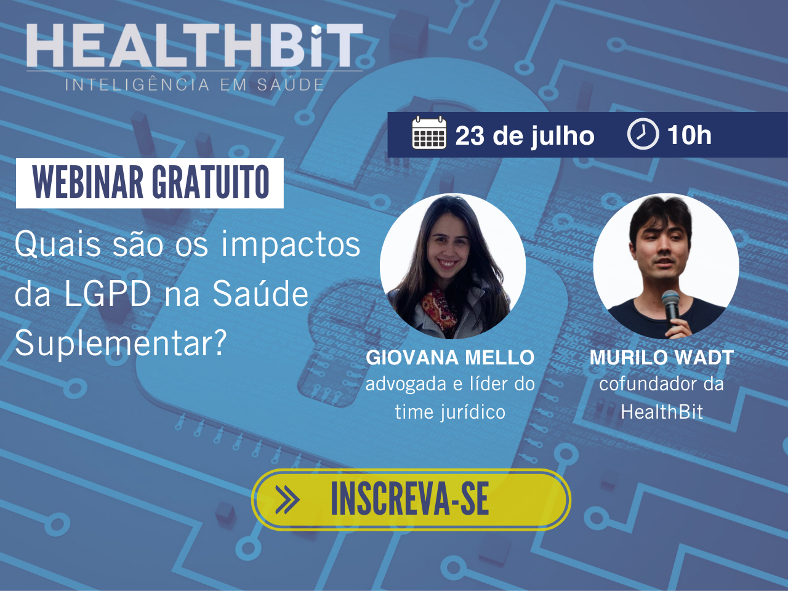

A [Lei Geral de Proteção de Dados (LGPD)](https://www.serpro.gov.br/lgpd/menu/a-lgpd/o-que-muda-com-a-lgpd) ainda assusta empresas, de todos os setores, que buscam se adequar para estar dentro da lei, que deve entrar em vigor em alguns meses no Brasil. Apesar do cenário de incerteza quanto ao início da aplicação da legislação, a **HealthBit** sempre se preocupou com a segurança e sigilo dos dados e, há algum tempo, começou a tomar providências para adequação à LGPD. Isso porque a área da saúde, especificamente, vai sofrer alguns importantes impactos e as empresas precisam estar atualizadas e preparadas para estas mudanças.

A LGPD é o nome da **Lei nº 13.709 de 2018, que regula todo o tratamento de dados pessoais e dados pessoais sensíveis realizado dentro do território nacional ou que vise o fornecimento e oferta de bens e serviços para pessoas localizadas no Brasil, ou mesmo que tenham sido coletados no país**. Por se tratar de como os dados das pessoas podem ser utilizados, a lei irá afetar todos os serviços que precisam que os clientes forneçam dados pessoais, principalmente a saúde.

Para contextualizar, a **normativa foi aprovada em 2018** e atualmente está com a data de vigência marcada para 03 de maio de 2021, com sanções a partir de 1º de agosto de 2021, sendo que o cenário que ainda pode sofrer modificações em razão da votação da MP 959/2020 no Congresso Nacional.

“A criação da norma em questão deu-se, sobretudo, por uma necessidade de atualização normativa no país, proporcionando segurança jurídica na regulamentação pátria do tema e fomentando oportunidades econômicas com países que exigem a conformidade em termos de proteção de dados para realização de qualquer negócio”, explica **Giovana Mello**, líder do setor jurídico da **HealthBit**.

Tanto o projeto quanto as diretrizes da Lei foram inspiradas no [Regulamento Geral de Proteção de Dados da União Européia](https://g1.globo.com/economia/tecnologia/noticia/lei-da-uniao-europeia-que-protege-dados-pessoais-entra-em-vigor-e-atinge-todo-o-mundo-entenda.ghtml) e justamente por conta disso que no Brasil foi criada a **Autoridade Nacional de Proteção de Dados**, em dezembro de 2018. Este órgão tem como intuito zelar, implementar e fiscalizar o cumprimento desta Lei em todo o território nacional.

## Visão geral sobre a LGPD

A LGPD possui diversos conceitos específicos que falam de modo geral a respeito de quais informações devem ser contempladas pela Lei, além de o que é o tratamento de dados e quais figuras que podem aparecer.

### Dados

Os dados que devem ser protegidos e se enquadram nesta normativa são de dois tipos: **dados pessoais e dados pessoais sensíveis.**

Os **dados pessoais** são aqueles que identificam ou tornam identificável qualquer pessoa natural. (Exemplos: dados cadastrais, data de nascimento, profissão, dentre outros).

Os **dados pessoais sensíveis** são informações que possibilitam a discriminação da pessoa natural identificada ou identificável, determinados pelo artigo 5º, inciso II:

- origem racial ou étnica;
- convicção religiosa;
- opinião política;
- filiação a sindicato ou a organização de caráter religioso,
- filosófico ou político;
- dado referente à saúde ou à vida sexual;
- dado genético ou biométrico, quando vinculado a uma pessoa natural.

Há ainda na lei a definição de **dados anonimizados**, que diz respeito a um dado relativo a titular que não possa ser identificado, considerando a utilização de meios técnicos razoáveis e disponíveis na ocasião de seu tratamento (processo denominado de anonimização). Após passar por essa desvinculação completa do titular, esse tipo de dado não é mais considerado pessoal, tornando-se uma hipótese de não aplicação da LGPD.

## Figuras da LGPD

Como a LGPD é uma lei introdutória, foram criadas posições e agentes para as relações disciplinadas. Tais figuras são as pessoas que assumirão determinado papel dentro da lei. Elas são:

- **Titular de dados:** pessoa natural a quem se refere os dados pessoais que receberão tratamento;
- **Controlador:** agente de tratamento, podendo ser pessoa física ou jurídica que coleta os dados para qualquer finalidade;
- **Operador:** agente de tratamento, que realiza operações em nome do Controlador;
- **Encarregado:** ou Data Protection Officer, é a pessoa responsável pela intermediação entre os agentes de tratamento, a ANPD e o titular dos dados. Será uma figura presente em todas as empresas.

Uma empresa pode se configurar como mais de uma figura de tratamento, se intercalando de acordo com o papel que desempenha.

**A HealthBit, por exemplo, pode operar como controladora e operadora.** O papel de **controladora** é assumido quando coletamos dados dos nossos colaboradores e terceiros em processos internos e coletamos dados de titulares de dados para implementação de programas de saúde, em conjunto com nossos clientes. E assumimos a figura de **operadora**, quando tratamos dados em favor de nossos clientes, dentro do escopo da nossa prestação de serviços, armazenamos dados para nossos clientes, a fim de auxiliar na análise de decisões futura e executamos programas de saúde, nos exatos moldes determinados pelos nossos clientes.

## Tratamento de Dados

Já sobre o tratamento de dados, a LGPD diz que é “toda operação realizada com dados pessoais, como as que se referem a coleta, produção, recepção, classificação, utilização, acesso, reprodução, transmissão, distribuição, processamento, arquivamento, armazenamento, eliminação, avaliação ou controle da informação, modificação, comunicação, transferência, difusão ou extração”. Ou seja, são basicamente todos os atos envolvendo o manuseamento de dados.

Para viabilizar e regulamentar o tratamento de dados no Brasil, a LGPD elencou as hipóteses nas quais fica permitido o uso de dados pessoais e dados pessoais sensíveis pelos agentes de tratamento, estando tais bases legais autorizadoras inseridas nos artigos 7 e 11 da norma, respectivamente.

E em relação a área da saúde? Como as empresas precisam atuar e quais são os impactos da LGPD no setor? Para isso, é preciso fazer um enquadramento das situações rotineiras da área da saúde conforme as bases legais autorizadas disponíveis na lei.

## Bases legais autorizadas na área de saúde

As bases legais são em quais termos alguma empresa pode realizar o tratamento de dados de forma adequada. Separamos algumas das possibilidades trazidas pela lei e que se encaixam com a área de saúde, que são mais específicas e sempre dependerão de uma análise ao caso, devendo ser observadas considerando as diferenças entre os dados pessoais e os dados pessoais sensíveis.

## Dados pessoais

Para dados pessoais, as hipóteses autorizadoras que consideramos mais importantes envolvendo a área da saúde são:

- Execução de contrato ou de procedimentos preliminares relacionados a contrato do qual seja parte o titular, a pedido do titular dos dados;
- Consentimento;
- Tutela da saúde, em procedimento realizado por profissionais da área da saúde, serviços de saúde ou por entidades sanitárias;
- Interesses legítimos do controlador ou de terceiro;
- Proteção da vida ou da incolumidade física do titular ou de terceiro;
- Cumprimento de obrigação legal ou regulatória pelo controlador.

## Impactos da LGPD na Saúde Suplementar

Além das disposições gerais e conceitos que comentamos acima, a LGPD trouxe também normas específicas para a área da saúde, como por exemplo os parágrafos 4 e 5 do artigo 11, impactando o setor tanto em razão da sensibilidade dos dados manuseados quanto pelos limites de tratamento inseridos quando o tratamento envolver dados de saúde.

Felizmente, o setor da saúde sempre lidou de forma responsável com os dados, observando os princípios de privacidade e confidencialidade, havendo diversas normas e diretrizes regulatórias tratando sobre o tema, como por exemplo:

- Resoluções do Conselho Federal de Medicina, Código de Ética e outros, que ressaltam a preocupação com a confidencialidade e a responsabilidade com os dados dos pacientes;
- Resolução normativa 305/12, da Agência Nacional de Saúde (ANS), que instituiu “Padrão obrigatório para Troca de Informações na Saúde Suplementar” (Padrão TISS);
- Resolução normativa 389/15, da ANS, que trata da transparência das informações no âmbito da saúde suplementar;
Resoluções da Agência Nacional de Vigilância Sanitária (ANVISA) e ANS, no geral, que mencionam a utilização de dados pessoais;

Apesar da necessidade de um contínuo diálogo entre a LGPD e as demais normas legais e regulatórias, o que se espera que aconteça com a atuação da Autoridade Nacional de Proteção de Dados, entendemos que o principal desafio para a implementação da nova lei é a criação de processos de controle de dados e governança, além do reforço no que diz respeito à segurança.

O compartilhamento e tratamento de dados no setor da saúde é fundamental, por muitos motivos, e justamente por isso que as empresas que atuam nessa área devem traçar um processo de adequação à LGPD, para que os direitos dos titulares sejam respeitados ao mesmo tempo em que o setor continue sendo movimentado.

A própria ANS, que é o órgão responsável pela regulação da saúde suplementar no Brasil, já divulgou uma [nota técnica (nº 3/2019/GEPIN/DIRAD-DIDES)](https://www.sbac.org.br/wp-content/uploads/2019/12/Nota-Te%CC%81cnica-sobre-LGPD.pdf) onde menciona que está em fase de revisão de políticas e implementação da lei, trazendo o plano de adequação do Gartner (empresa especializada) com as etapas para conformidade:

Desta forma, com a criação de processos internos, uma comunicação adequada e a adoção de procedimentos técnicos e administrativos indispensáveis para o cumprimento da lei, a expectativa é que as empresas do setor da saúde suplementar se adequem e ajudem a reforçar ainda mais a segurança e privacidade que já eram inerentes da área.

Todos os conceitos apresentados são introdutórios e precisam ser aprofundados. É por isso que a LGPD e os impactos da Saúde Suplementar é o tema do **2º Webinar da HealthBit**, que vai ser apresentado pela líder do time jurídico da HBit, Giovana Mello. O webinar vai passar por conceitos gerais até um debate sobre a adequação das empresas do setor com relação à nova lei. Nosso CEO, Murilo Wadt, também participará do webinar e trazer um pouco da experiência e processo de conformidade da HealthBit.

O Webinar: Quais são os impactos da LGPD na Saúde Suplementar **acontece na quinta-feira, dia 23 de julho, às 10h, e a inscrição é gratuita**. Para se inscrever, acesse: [https://comunicacao.healthbit.com.br/webinarlgpd](https://comunicacao.healthbit.com.br/webinarlgpd)