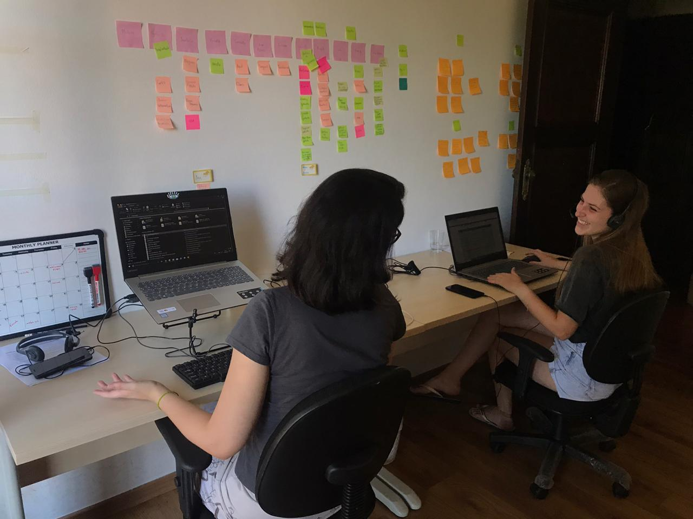

Segurança e saúde é uma preocupação geral, seja dos trabalhadores ou dos empresários. **A medicina preventiva pode ser o segredo para acabar com essa preocupação e ainda para redução de gastos** com tratamento de doenças que podem ser evitadas, especialmente as “doenças da modernidade” como o estresse, ansiedade e depressão. **Um dos pilares importantes da HealthBit é a prevenção de casos graves** e aliamos nossa tecnologia e análise de dados para oferecer também um plano de política de melhorias e todo o suporte na mudança.

Algumas práticas da medicina preventiva já são comuns em empresas brasileiras, como por exemplo, os exames periódicos por parte dos empregadores para com os trabalhadores. Na verdade, estes exames estão regulamentados [(portaria nº 3124)](https://bvsms.saude.gov.br/bvs/saudelegis/gm/2012/prt3124_28_12_2012.html) e obrigatórios:

- para demissão;
- para retorno ao trabalho;
- para admissão;
- para mudança de função;
- além dos exames periódicos.

Na lei, é possível ver também que existe um intervalo de tempo que deve ser cumprido para fazer novos exames de acordo com a idade e o cargo dos trabalhadores. Por exemplo, para os que estão expostos a riscos um exame anual ou com menor frequência é o indicado.

Nem todas as empresas estão atentas e preparadas para exercer a medicina preventiva, que vai muito além destes exames citados na normativa. É importante lembrar que quando um funcionário precisa ser afastado por causa de algum problema de saúde, a empresa também sai prejudicada. A medicina preventiva oferece uma segurança e pode garantir que as empresas reduzam essa perda financeira e, mais do que isso, melhorar a qualidade de vida dos colaboradores.

Separamos algumas medidas simples e que podem ser adotadas por empresas de todos os portes. É importante lembrar que ter um acompanhamento e uma atuação integrada com especialista é fundamental.

## Como evitar problemas de saúde

### Exames básicos

Alguns exames básicos que são simples e baratos podem ser feitos dentro da própria empresa e de maneira mais assertiva, já que cerca de 30% das pessoas que realizam exames, não buscam os resultados ou não fazem o retorno com o médico, onerando desnecessariamente o sistema. São exames como taxa de glicemia, colesterol, pressão arterial, bem como exames de urina e de fezes, que podem exercer papel fundamental para a detecção de doenças de maneira preventiva.

### Campanhas

As campanhas preventivas e que, geralmente, são nacionais, já fazem parte da rotina anual de muitas empresas, mas, mesmo assim, vale lembrar o quão importante são. Campanhas como as de vacinação, setembro amarelo, outubro rosa e novembro azul, são ideais para conscientizar os colaboradores sobre segurança e saúde. Vale incentivá-los a procurar médicos e fazer exames de rotina, falar sobre sintomas e prevenção. [Acompanhe as campanhas do governo e faça uma projeção dentro da empresa.](https://www.saude.gov.br/campanhas)

### Informativos e palestras educativas

Aliado das campanhas, os informativos e as palestras educativas podem dar forças à medicina preventiva. Mensalmente é primordial trabalhar assuntos relevantes e de grande importância para a saúde do trabalhador. Os informativos podem ser enviados por e-mail, exibidos em televisores ou colados nas paredes pela empresa. A dica é bem simples: **com a ajuda de um profissional da saúde, elabore um conteúdo explicativo e que possa ajudar a informar e prevenir doenças e acidentes.**

**As palestras agregam ainda mais confiança e credibilidade nesta jornada de cuidado com o colaborador.** Periodicamente é interessante convidar um profissional da saúde, especialista em determinados assuntos, para fazer uma apresentação e conversar com toda a equipe!

### Ginástica laboral ou yoga

É uma maneira de prevenir que os trabalhadores desenvolvam doenças musculares, nervosas e articulares. A movimentação do corpo ajuda a lubrificar as articulações, a alongar a musculatura e, também, melhora a disposição para o trabalho. Além disso, movimentar o corpo também ajuda a relaxar e descansar a mente, auxiliando o colaborar a diminuir o estresse.

A prática do yoga pode ser uma alternativa mais divertida e que com melhor adesão dos colaboradores. Porém, ambas vão trazer benefícios e qualidade de vida para a equipe! Uma sugestão é contratar um profissional qualificado para ministrar as aulas e alongamento.

### Treinamentos periódicos

Para que os trabalhadores tenham mais segurança no ambiente de trabalho é importante oferecer os equipamentos de proteção individual (EPI). A própria empresa deve fornecer os equipamentos de forma gratuita e todos devem ser treinados para usá-los da maneira correta. Para evitar acidentes e doenças, é interessante **oferecer reciclagem dos treinamentos periodicamente**, especialmente para trabalhadores que manuseiam máquinas e/ou de fábrica.

Uma dica importante, e que pode fazer a diferença durante esse período de pandemia, é **adaptar os termos de trabalho oferecidos aos novos funcionários** e até considerar adicionar benefícios relevantes à nossa situação atual. Ofereça uma assinatura paga para algum aplicativo de bem-estar, serviços gratuitos de entrega de refeições. Já faz parte da cultura da **HealthBit** oferecer o **auxílio saúde mental** como parte dos benefícios e é, sem dúvidas, algo que faz muita diferença. [Confira aqui outros benefícios que podem ser fator decisivo para os talentos na hora de fazer uma proposta e reter talentos.](http://blog.healthbit.com.br/4-beneficios-que-sua-empresa-pode-oferecer-para-reter-talentos)

## A tecnologia e a medicina preventiva

As soluções que apresentamos realmente podem ter eficácia nas empresas, mas, antes de começar qualquer projeto para segurança e prevenção dos colaboradores, é preciso analisar e estudar o ambiente de trabalho. Não adianta simplesmente aderir a todas as propostas e tentar colocá-las em prática sem antes ter um planejamento.

A **HealthBit** está preparada para diminuir erros e otimizar os benefícios de uma empresa, com tecnologia de ponta e o compromisso de criar soluções novas para uma saúde melhor e mais humana. Depois de assinar o contrato com uma empresa e coletar os dados, nossa equipe faz uma análise inicial e prepara um plano para melhoria de políticas.

**As campanhas preventivas são ainda eficientes quando aliadas à tecnologia desenvolvida pela HealthBit:** “temos os scripts automatizados em nosso sistema e, durante essas campanhas, fazemos um levantamento de pessoas que realizaram exames específicos (relacionados a campanha) no último ano ou então, pessoas que têm a idade para realizar os exames mas não realizaram. Este segundo grupo pode ser considerado de risco e então damos uma atenção especial para que sejam estimulados a realizar o exame”, **explicou Milene Marmol, líder de saúde da HBit.**

Outra solução de prevenção muito eficaz oferecida pela HealthBit é o acompanhamento de saúde. **Os enfermeiros ligam regularmente para os colaboradores e avaliam o histórico do paciente.** Este acompanhamento à distância é um diferencial que proporciona segurança para o colaborador e também para a empresa, **evitando casos de afastamento desnecessários que podem afetar a produção de uma corporação.**

Ainda existem muitas outras alternativas e caminhos a seguir para levar a saúde aos trabalhadores de uma empresa, evitar casos graves e sofrimentos desnecessários. Mas, **é importante lembrar que é preciso planejamento e análise para tomar decisões assertivas**. De qualquer forma, o que não dá pra negar é que investir em medicina preventiva é fundamental para manter a saúde dos funcionários em dia e para reduzir os custos que podem ser evitados para empresas. [Conte com nossos especialistas para saber sobre nossas ideias e soluções especiais para sua empresa.](http://healthbit.com.br/contatocomercial)