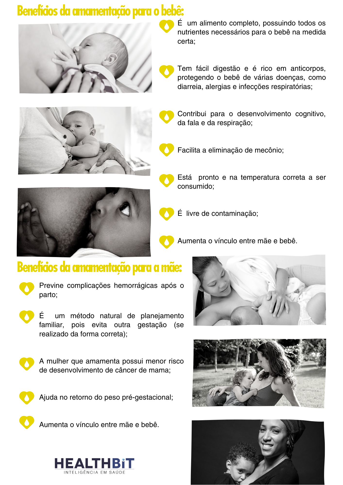

Não é segredo que o aleitamento materno é uma das maneiras mais eficazes de garantir a saúde e a sobrevivência de um bebê, especialmente até os 6 meses de idade. Porém ainda existem muitas **dúvidas e questionamentos que fazem com que a média brasileira de amamentação exclusiva seja muito baixa.** Atualmente, o índice da amamentação exclusiva até os 6 meses do bebê é de **38,6% no Brasil**, de acordo com o UNICEF e a OMS.

Com o objetivo de aumentar essa taxa e conscientizar mães, pais e familiares sobre a importância da amamentação, surgiu o **Agosto Dourado**. É uma iniciativa mundial com intensas atividades que buscam promover o aleitamento exclusivo até o sexto mês de vida, se estendendo até os dois anos ou mais. Neste ano, a **Semana Mundial de Aleitamento Materno (SMAM)** acontece nos dias 1º a 7 de agosto.

[Dados da Organização Mundial da Saúde](https://www.who.int/health-topics/breastfeeding#tab=tab_1) revelam que a taxa do aleitamento exclusivo melhorou bastante nas últimas décadas e atualmente 2 em cada 3 bebês não são amamentados exclusivamente nos 6 meses recomendados. E, ainda de acordo com a OMS, a comercialização inadequada de substitutos do leite materno prejudica os esforços para melhorar as taxas e a duração da amamentação em todo o mundo.

Mulheres em todo o mundo sofrem, ainda durante a gestação, com o medo e a insegurança sobre a amamentação. E, assim, surgem algumas inverdades que podem colaborar com a baixa taxa do aleitamento exclusivo. Por isso, o **time de saúde da HealthBit** respondeu as perguntas mais frequentes sobre a amamentação para acabar de vez com essas dúvidas:

- **Tenho a mama pequena então não vou ter leite o suficiente para amamentar meu bebê.**

Mito. Não é possível avaliar a capacidade de produção do leite de acordo com o tamanho das mamas. A produção adequada de leite está associada a muitos fatores: bem estar materno, pega correta do bebê na mama, retirada do leite de forma adequada pelo bebê, alimentação saudável, ingestão adequada de água, ambiente tranquilo e apoio dos familiares são alguns dos itens dessa lista.

- **Meu mamilo é plano ou invertido, então não vou conseguir amamentar.**

Mito. Alguns mamilos são realmente mais favoráveis para a amamentação, como os protusos, mas os outros tipos também conseguem amamentar! São raríssimos os casos em que o desmame é necessário devido a dificuldades relacionadas ao tipo de bico. Ajustes podem ser necessário e favorecem a pega correta para uma amamentação efetiva, sendo um momento agradável para mãe e bebê.

- **Meu leite é fraco e não está sustentando o meu bebê.**

Mito. **Não existe leite fraco.** Repita: não existe leite fraco! A produção de leite materno está intimamente ligada com as necessidades dos bebês, ou seja, ele se adapta de acordo com seu desenvolvimento do bebê, alterando sua composição.

- **Meu leite diminuiu, minhas mamas não ficam tão cheias como antes e vou ter que oferecer fórmula infantil para meu bebê poder crescer saudável.**

Calma! É normal sentir que as mamas não ficam tão cheias passado alguns meses de amamentação. Isso se deve à nossa capacidade de adaptação às demandas do bebê. O corpo feminino é sábio e produz aquilo que é necessário para o bebê. Se sua mama não fica tão cheia mas o bebê demonstra satisfação após as mamadas, está ganhando peso adequadamente, faz xixi várias vezes ao dia e evacua com frequência, está tudo bem! Se tiver dúvidas, converse com o pediatra do seu bebê. Caso sua produção realmente tenha diminuído, é possível recorrer à protocolos para estimular o aumento do volume de leite produzido. Para isso, procure uma consultora em amamentação capacitada ou um banco de leite em sua cidade e você receberá as orientações necessárias.

- **Meu bebê está muito irritado, parece que está com fome mesmo mamando, vou oferecer o leite artificial (fórmula infantil) e isso vai resolver esse problema.**

Cuidado. Temos a ideia de que a fórmula infantil é um alimento como qualquer outro, mas NÃO É! Apenas profissionais capacitados como pediatras e nutricionistas são capazes de avaliar a real necessidade do uso do leite, de acordo com o crescimento e desenvolvimento do bebê. Para o uso é necessário a **prescrição médica ou do nutricionista**, com o volume e frequência que o leite deve ser oferecido ao bebê, de acordo com suas necessidades e restrições. Fórmula láctea apenas com prescrição!

- **A mamadeira é a melhor forma de oferecer o leite ao bebê nos momentos em que não posso amamentá-lo.**

Mito. Existem outras formas que favorecem a continuidade da amamentação. O copinho, a colher dosadora e o copo de transição de bico rígido são algumas das opções. Então se precisar que outra pessoa ofereça o leite ao bebê, escolha opções que interfiram menos na amamentação.

- **Vou retornar ao trabalho, então preciso desmamar meu bebê e oferecer a fórmula para ele se acostumar.**

O desmame não é necessário. No retorno ao trabalho é importante que se faça um planejamento, sendo possível a manutenção da amamentação complementada ou até mesmo exclusiva. Planejar a ordenha para manter uma reserva de leite antes do retorno, oferecer o leite de forma que proteja a amamentação, manter a ordenha nos momentos em que está longe do bebê são algumas das estratégias para a manutenção da amamentação após o retorno ao trabalho.

Em época de Covid-19, algumas lactantes ficam preocupadas sobre a amamentação, seja ela exclusiva ou não. Então, vale lembrar que **mesmo com o diagnóstico positivo para o novo coronavírus, até o momento, não se tem evidências científicas que demonstrem a passagem do vírus pelo leite materno.**

Mas ainda assim, se o teste for positivo, todas as precauções devem ser tomadas: isolamento domiciliar, preferencialmente com bebê e mãe em quartos separados; distanciamento mínimo de 1 metro entre o berço do bebê e a mãe; realizar a etiqueta respiratória (uso de máscaras); higienizar as mãos imediatamente após tocar nariz, boca e sempre antes do cuidado com o bebê; usar máscara durante todo o cuidado do bebê e amamentação e caso precise circular em áreas comuns da casa.

Vale lembrar que, segundo a Organização Mundial da Saúde, o leite materno é seguro, limpo e contém anticorpos que ajudam a proteger contra muitas doenças comuns da infância. **O leite materno fornece toda a energia e nutrientes** que o bebê precisa nos primeiros meses de vida e continua a fornecer até metade ou mais das necessidades nutricionais de uma criança mesmo após o segundo ano de vida!

As crianças que são amamentadas têm melhor desempenho em testes de inteligência, melhor imunidade e são menos propensas a diabetes mais tarde na vida. Já as mulheres que amamentam também tem benefícios: risco reduzido de câncer de mama e ovário.

A amamentação só traz benefícios para mãe e bebê, mesmo após o período de aleitamento materno exclusivo aos seis meses. Não é à toa que a OMS e a UNICEF recomendam a amamentação até os 2 anos de idade ou mais: [“o leite materno também é uma fonte importante de energia e nutrientes em crianças de 6 a 23 meses. Pode fornecer metade ou mais das necessidades energéticas de uma criança entre 6 e 12 meses e um terço das necessidades energéticas entre 12 e 24 meses. O leite materno também é uma fonte crítica de energia e nutrientes durante a doença e reduz a mortalidade entre as crianças desnutridas.”](https://www.who.int/news-room/fact-sheets/detail/infant-and-young-child-feeding)

Não deixe de acompanhar a HealthBit nas redes sociais para ficar por dentro de atualizações na área da saúde, inclusive do Agosto Dourado e amamentação. Mas, eventualmente, se surgirem dúvidas, procure pessoas especializadas para te ajudar como consultoras de amamentação, pediatras e obstetras.