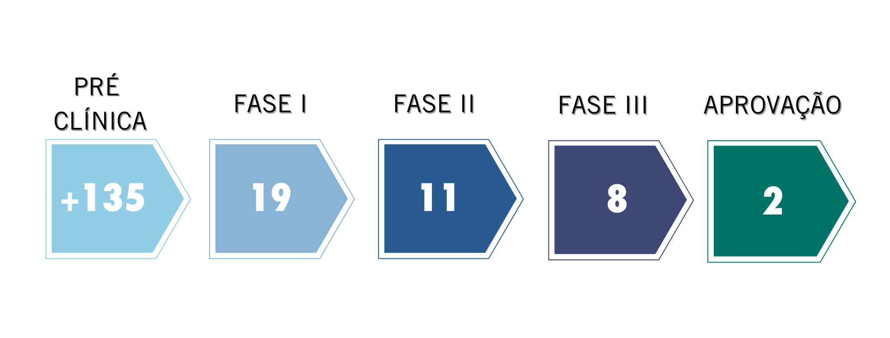

Novas vacinas exigem anos de pesquisas e testes antes de finalmente serem aprovadas. Mas, além de trazer instabilidade no mercado e redescobertas nas formas de viver e trabalhar, o novo coronavírus também trouxe uma corrida contra o tempo para desenvolver uma vacina segura e eficaz contra a covid-19. E quando teremos esta vacina?

Recentemente, o diretor-geral da OMS, [Tedros Adhanom Ghebreyesus](https://www.linkedin.com/in/tedros-adhanom-ghebreyesus/), declarou que uma vacina ou cura para a covid-19 talvez nunca se torne realidade do jeito que a população idealiza. Apesar dos julgamentos pessimistas, Tedros explicou que **ainda não é possível saber até que todos os testes sejam concluídos mas há sim, sinais de esperança**.

Atualmente, pesquisadores de todo o mundo estão estudando dia e noite para encontrar o que pode ser a solução do problema mundial e até a recuperação da economia. A [Organização Mundial da Saúde reconhece mais de 165 vacinas](https://www.who.int/publications/m/item/draft-landscape-of-covid-19-candidate-vaccines) e, destas, 30 já estão nas fases mais avançadas e com grande expectativas.

## O processo e as fases clínicas da vacina

Para desenvolver uma vacina é preciso passar por uma série de fases até que chegue a aprovação e então começar efetivamente a produção. Por enquanto, a maioria das vacinas estão na fase pré clínica e apenas 2 estão na fase final de aprovação:

**PRÉ CLÍNICA:** É a fase inicial da pesquisa onde estão sendo testadas ideias e estratégias que se provem eficazes. Se inicia os testes em camundongos e macacos, cujos organismos reagem ao vírus de forma similar ao humano.

**FASE I:** Após dados positivos com testes em animais, se inicia a etapa de testagens em humanos. Eles são realizados com uma amostra muito pequena para verificar a segurança, potenciais efeitos colaterais e o equilíbrio entre a dose mais eficaz contra o vírus sem que cause danos a quem se vacinou.

**FASE II:** Nessa fase se inicia a testagem em centenas de pessoas para avaliar os resultados. O objetivo é avaliar a resposta imune do organismo à vacina, se os anticorpos produzidos possuem eficácia e se realmente a vacina tem potencial para imunizar contra o vírus.

**FASE III:** Fase que se avalia de fato a eficácia da vacina na prática. Para tanto, milhares de pessoas são vacinas, ampliando a escala de testes. A proposta nessa fase é avaliar como a vacina se comporta no mundo real, sendo assim a expectativa dos pesquisadores é que os voluntários efetivamente se exponham ao vírus para saber se eles estão ou não protegidos pelo composto.

**APROVAÇÃO:** Após a fase III, é possível assegurar que a vacina realmente funciona como se espera ou não. A partir desses resultados, a legislação de cada país decide se aprova ou não a vacina para ser distribuída para a população.

[Neste informativo elaborado pelo time saúde da HBit você consegue ler sobre quais são as principais vacinas desenvolvidas.(https://covid19.healthbit.com.br/node/49)]

Recentemente, as autoridades russas informaram que o país produziu o primeiro lote da vacina contra o novo coronavírus. ["O primeiro lote da nova vacina contra a covid-19 foi produzido no Centro de Pesquisas Gamaleya", anunciou o ministério da saúde da Rússia em um comunicado, citado pelas agências de notícias do país.](https://noticias.uol.com.br/ultimas-noticias/afp/2020/08/15/russia-anuncia-producao-do-primeiro-lote-da-vacina-contra-o-coronavirus.htm?cmpid=copiaecola) Por outro lado, alguns cientistas fazem um alerta: uma vacina desenvolvida de maneira precipitada pode ser perigosa, pois a fase final dos testes começou há pouco tempo.

## Obstáculo: matéria prima

As fases e o processo do desenvolvimento e estudo das vacinas não são as únicas preocupações por aqui. O superintendente da [Associação Brasileira da Indústria de Artigos e Equipamentos Médicos e Odontológicos (Abimo)](https://abimo.org.br/), Paulo Henrique Fraccaro, declarou que o Brasil pode encarar dificuldades [na aplicação da possível vacina contra a covid-19 por falta de seringas e agulhas](https://www1.folha.uol.com.br/colunas/monicabergamo/2020/08/vacina-contra-covid-19-pode-nao-ter-agulha-para-ser-aplicada-no-brasil-alertam-fabricantes.shtml).

**O problema é que Brasil vai precisar no mínimo de 300 milhões de seringas num prazo de três ou quatro meses e o tempo gasto para a produção de apenas 50 milhões de seringas é de cinco meses.** E vale lembrar que o país não para de oferecer vacinas e nem as campanhas de vacinação do calendário do governo, como sarampo e gripe, ou seja, são ainda mais seringas na conta da produção.

De qualquer forma, o Ministério da Saúde já garantiu que as aquisições de seringas e agulhas serão compatíveis com a necessidade de cobertura populacional.

## Protocolos de saúde

A ansiedade pela vacina e os avanços dos protocolos de fases impostos pelo governo, junto com a abertura de restaurantes e estabelecimentos, podem causar a falsa impressão de relaxamento nos protocolos de saúde. Porém, [Tedros Adhanom Ghebreyesus, da OMS, recorreu ao LinkedIn](https://www.linkedin.com/in/tedros-adhanom-ghebreyesus/) para lembrar a população de continuar usando máscaras e álcool gel.

A Organização Mundial da Saúde ainda lançou um desafio, que começou na sexta-feira, dia 14: **#WearAMask Challenge**. A ideia é conscientizar as pessoas a continuar usando a máscara e para isso, publique uma foto com a hashtag do desafio e ainda incentive outros amigos a fazer o desafio também. Nas redes sociais oficiais da HealthBit ([LinkedIn](http://linkedin.com/company/healthbit), [Facebook](http://facebook.com/healthbitoficial) e [Instagram](http://instagram.com/healthbitoficial)) já publicamos nosso desafio com nosso time usando máscara!

E ainda vale lembrar que a máscara sozinha não vai impedir a contaminação do vírus, por isso, é preciso seguir as recomendações da OMS:

- Manter distância física
- Lavar as mãos com frequência
- Usar álcool 70% para limpar superfícies e higienizar as mãos
- Evitar aglomeração
- Cobrir boca e nariz com o braço ao espirrar ou tossir e lavar as mãos imediatamente

Temos que reconhecer que estudos sobre a vacina estão sendo desenvolvidos a uma velocidade surpreendente, nunca visto anteriormente, num esforço contínuo e mútuo de diversos pesquisadores e países.

Apesar dos vários testes em andamento e muito promissores com prazo curto de serem aprovados, a confecção e distribuição das vacinas em larga escala não é tão rápida. Dessa forma, mesmo com uma vacina criada não significa que toda a população será vacinada no mesmo mês ou mesmo ainda este ano.

No [Portal COVID-19 da HealthBit](https://covid19.healthbit.com.br/) ainda é possível fazer download dos materiais completos elaborados pela equipe de dados e saúde da HBit, com informações oficiais e atualizadas sobre a situação do novo coronavírus e como proteger seus colaboradores. Lá você vai encontrar informações sobre [como usar a máscara, isolamento social, o que precisa saber sobre testes](https://covid19.healthbit.com.br/node/32) e muito mais!