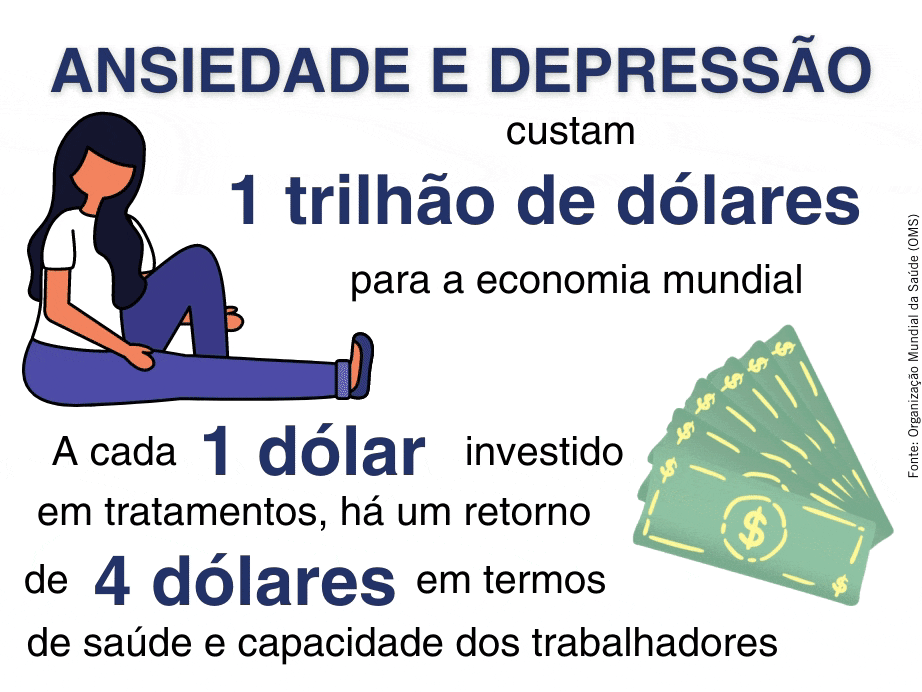

Segundo [pesquisa da Universidade do Estado do Rio (Uerj)](https://www.cnnbrasil.com.br/saude/2020/05/09/estudo-indica-aumento-em-casos-de-depressao-durante-isolamento-social), **entre março e abril, os casos de ansiedade foram de 8,7% para 14,9% no Brasil**. O motivo é a pandemia do novo coronavírus e o isolamento social, que fez com que os problemas de saúde mental como ansiedade e estresse, aumentem. Porém, esta questão que se agravou cada vez mais durante este período já era algo preocupante antes. [Em 2019, a Organização Mundial da Saúde (OMS) divulgou dados que mostram que cerca de 19,4 milhões de brasileiros sofrem de ansiedade](https://www.uol.com.br/vivabem/noticias/redacao/2019/10/10/dia-mundial-da-saude-mental-brasil-lidera-ranking-de-depressao-e-ansiedade.htm), o que nos torna o país em primeiro lugar na lista de países mais ansiosos do mundo. Além disso, de acordo com dados da International Stress Management Association no Brasil (ISMA-BR), a síndrome de burnout atinge 30% da população economicamente ativa no Brasil.

Antes de entrarmos em como esses problemas afetam o trabalho, vamos entender um pouco mais sobre eles e seus sintomas.

## Sintomas da ansiedade e do estresse

A [ansiedade](https://hospitalsantamonica.com.br/saude-mental/ansiedade/) é um distúrbio psiquiátrico no qual a pessoa possui um excesso de apreensão ou expectativa (tipo a animação de quando se vai viajar, mas em uma intensidade muito maior). Esses sentimentos podem ocorrer e permanecer por períodos curtos, médios e longos ou podem acontecer de forma episódica.

- Ela pode desenvolver sintomas psicológicos e físicos, alguns deles podendo ser:
- Preocupações, medos ou tensões excessivas que não permitem a pessoa relaxar;
- Falta de controle sobre os pensamentos (pensamento acelerado), que se repetem independente da vontade;
- Falta de ar;
- Ondas de calor;
- Palpitações;
- Tonturas;
- Tremores;
- Angústia excessiva.

Já o [estresse](https://zenklub.com.br/blog/saude-bem-estar/estresse-tudo-que-precisa-saber/) é uma mescla de reações físicas e mentais do nosso corpo quando estamos em situações que nos trazem um grande esforço emocional. Essas situações podem ser prazos muito curtos, alta demanda de trabalho e, até mesmo, problemas causados tanto no escritório, quanto fora dele. Os principais sintomas são:

- Alteração no humor;
- Desgaste constante;
- Mudanças no sono, seja dormir muito ou pouco;
- Tensão nos músculos;
- Alterações no apetite;
- Desinteresse pelas atividades;
- Dificuldades de concentração;
- Problemas de atenção e memória;
- Formigamentos;
- Preocupações excessivas e de maneira constante;
- Náuseas e tonturas;
- Procrastinação;
- Dores no corpo, principalmente, no peito.

Apenas analisando os sintomas, já é possível perceber quais formas a ansiedade e o estresse podem afetar um colaborador e uma empresa.

## Os impactos da ansiedade e do estresse no trabalho

### Muitos erros

Quando a pessoa está ansiosa e/ou estressada, ela pode começar a se preocupar excessivamente com tudo e, inclusive, passa a errar em diversas coisas ou trabalhos, por estar se preocupando ou sem foco. Assim, ela passa a errar muito e com frequência.

### Postura autoritária

Um funcionário estressado pode começar a adotar uma postura autoritária por conta do acúmulo de estresse. Por conta dos conflitos emocionais, ela começa a descontar nas pessoas ao seu redor, dando ordens em excesso, não aceitando críticas e erros.

### Situações de conflito

Outra questão focada mais no estresse é que ele pode causar situações de conflito. Seja por conta da postura autoritária ou por outro fator, pode começar a haver situações de conflito entre alguns colaboradores.

### Isolamentos e problemas de interação entre os colegas

Pessoas estressadas e ansiosas tendem se isolar socialmente, evitando interações com as pessoas. Esse isolamento também pode vir da vontade de evitar conflitos com os colegas.

Isso pode dificultar que exista um ótimo ambiente de trabalho na empresa e dificuldade de adaptações para as realizações de tarefas em equipes.

### Aumento de absenteísmo

Tanto a ansiedade quanto o estresse apresentam sintomas físicos. Desta forma, a pessoa pode começar a se ausentar muito do trabalho por conta de dores de cabeças, dores de estômago, taquicardia e falta de ar. Além disso, a pessoa pode parar de sentir motivação no trabalho realizado e começar a faltar.

### Falta de produtividade

Todos os impactos anteriores desencadeiam na falta de produtividade por parte do profissional. Como a dificuldade de concentração é um dos sintomas tanto do estresse quanto da ansiedade, um dos principais impactos é na produtividade dos colaboradores. Em ambos os problemas, a pessoa fica sempre em alerta e esgotada, o que traz dificuldade para a concentração em uma só tarefa.

A falta de produtividade pode ser ocasionada, também, pela insônia que a pessoa que sofre com ansiedade e estresse pode ter, pelo cansaço que ela passa a sentir.

De acordo com uma [pesquisa da OMS](https://nacoesunidas.org/depressao-e-ansiedade-custam-us1-tri-por-ano-a-economia-global-diz-oms/), **depressão e ansiedade custam 1 trilhão de dólares para a economia mundial e a cada dólar investido em tratamentos há um retorno de quatro dólares em termos de saúde e capacidade dos trabalhadores**. Por conta disso, é muito importante a empresa ter um bom meio-ambiente e que este, e a cultura, promovam e incentivem cuidados com a saúde mental.

Aqui na HealthBit acreditamos que é muito importante cuidarmos da saúde mental dos funcionários da sua empresa com palestras, informações e apoio de toda nossa equipe de saúde. Além disso, fazemos isso na prática aqui dentro, pois mesmo com a pandemia e o home office, estamos fazendo diversas [medidas para cuidar da saúde mental dos nossos colaboradores](https://blog.healthbit.com.br/pandemia-como-a-HealthBit-esta-cuidando-da-saude-mental-dos-funcionarios?utm_campaign=later-linkinbio-healthbitoficial&utm_content=later-6797821&utm_medium=social&utm_source=instagram).

E acompanhe o #BlogHBit porque mês que vem traremos diversas dicas e conteúdos sobre saúde mental!