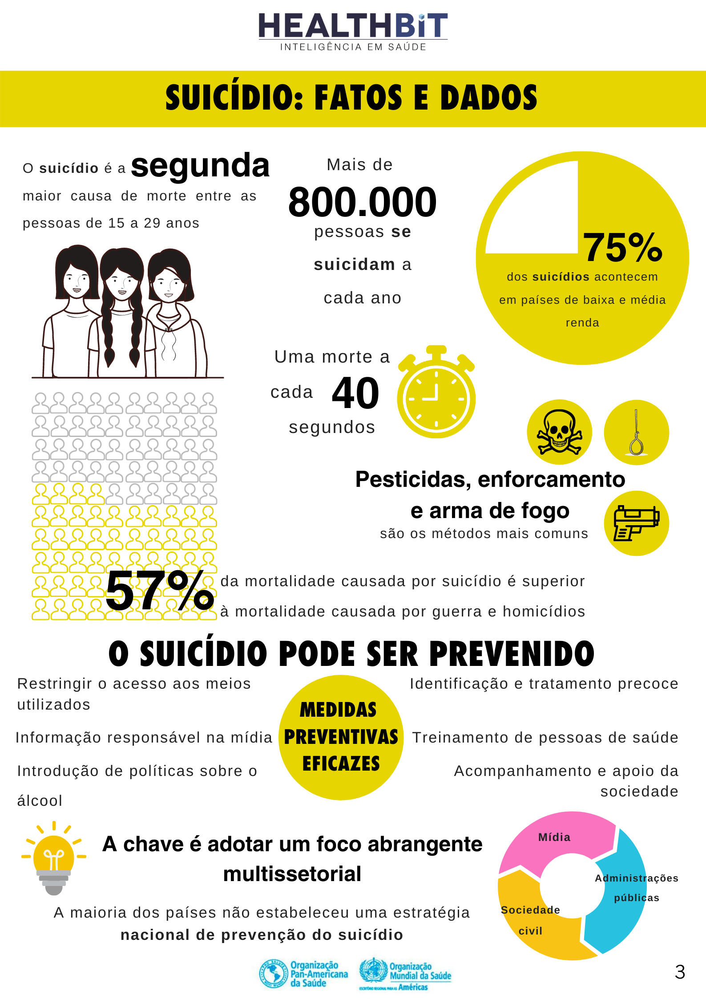

Setembro começou e com ele a campanha internacional “Setembro Amarelo”. Você deve se lembrar que em algum momento já viu o Cristo Redentor (RJ) iluminado de amarelo ou então o Palácio do Itamaray (DF), não é? Esta é uma das formas de apoiar a **campanha de conscientização sobre a prevenção do suicídio**. Mas não é só sobre suicídio que o Setembro Amarelo alerta, é também sobre **saúde mental** e por isso é tão importante incentivar e aderir a campanha dentro da sua empresa.

O **Setembro Amarelo** foi criado no Brasil em 2015 pelo [Centro de Valorização da Vida](https://www.cvv.org.br/), conhecido como CVV, junto com o [Conselho Federal de Medicina e a Associação Brasileira de Psiquiatria](https://portal.cfm.org.br/).

A Organização Mundial da Saúde conta que são mais de 800.000 pessoas que cometem suicídio a cada ano, o que representa **uma morte a cada 40 segundos no mundo**. E, como mostra o infográfico abaixo, por mais incrível que pareça, o suicídio é a segunda causa de morte na faixa etária de **15 a 29 anos**.

## Por que devo fazer a campanha dentro da minha empresa?

A campanha do Setembro Amarelo é muito importante porque levanta uma questão que precisa estar sempre em pauta: **saúde mental**. E é claro que é preciso cuidar do colaborar e prevenir transtornos mentais como depressão, transtorno bipolar e do abuso de substâncias.

Não é preciso ir muito afundo para saber que um colaborador com algum transtorno mental pode ter o quadro piorado quando está em um ambiente de trabalho tóxico ou apenas sob pressão de prazos, o que é comum em muitas empresas. Um exemplo é a síndrome de burnout, um distúrbio psíquico de caráter depressivo, precedido de esgotamento físico e mental intenso e que também pode levar ao suicídio.

Por isso, falar sobre saúde mental e aderir à campanha do Setembro Amarelo é também uma forma de prevenção e cuidado com seu colaborador. No Brasil são registrados cerca de *12 mil suicídios todos os anos** e, de acordo com dados do Ministério da Saúde, cerca de **96,8% dos casos de suicídio estão relacionados a transtornos mentais. É a oportunidade perfeita para criar a cultura de cuidar saúde mental dos colaboradores**.

Na prática, existem muitas maneiras de abordar o tema e é possível realizar uma ou mais estratégias que condizem com o momento e contexto de sua organização. Pensando nisso, a equipe de saúde da HealthBit elaborou uma cartilha sobre Setembro Amarelo em Corporações. Lá é possível ter acesso ao material completo sobre o tema e ainda dicas de **“como identificar que seu colaborador precisa de ajuda?”** e “ações de prevenção em empresas”.

Para fazer o download gratuito da cartilha para corporações, acesse: [https://comunicacao.healthbit.com.br/setembro-amarelo-corporacoes](https://comunicacao.healthbit.com.br/setembro-amarelo-corporacoes). 