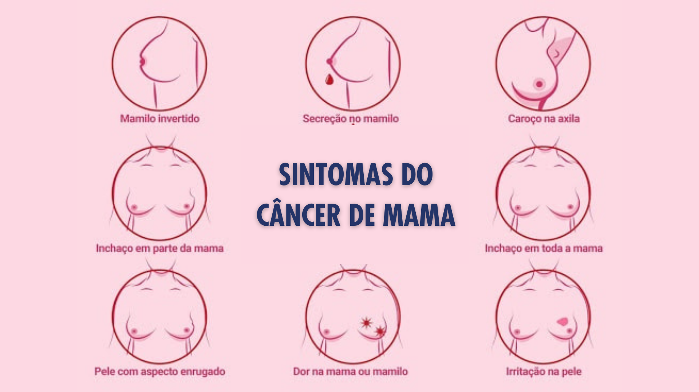

Outubro é conhecido como o mês das crianças e também o Dia das Bruxas e por mais divertidas e emocionantes que estas datas sejam, há algo ainda mais especial sobre o mês de outubro: é o mês da conscientização sobre o câncer de mama. A Campanha Outubro Rosa é um momento de doar, apoiar e promover a conscientização e informação sobre o autocuidado e prevenção do câncer de mama. **Você precisa apoiar a campanha Outubro Rosa e vamos te mostrar como você pode fazer isso!**

Provavelmente você conhece ou já ouviu falar de alguma mulher, no seu ciclo de amizade, que foi diagnosticada com a doença. [No Brasil, apenas neste ano de 2020, mais de 66 mil mulheres receberam o diagnóstico de câncer de mama e outras 16 mil de colo de útero](https://www.inca.gov.br/numeros-de-cancer). Estes dois tipos de cânceres estão também no topo da lista dos que mais causam fatalidade de mulheres brasileiras.

Uma pesquisa feita por uma organização norte-americana revelou que [1 em cada 8 mulheres desenvolverá câncer de mama ao longo da vida](https://www.breastcancer.org/symptoms/understand_bc/statistics). Os Estados Unidos espera mais de 270 mil novos casos da doença somente neste ano.

O câncer de mama não escolhe classe social ou racial e os números assustam. É por isso que a Campanha Outubro Rosa movimenta o mundo todo para conscientizar a população, principalmente as mulheres, para o controle do câncer de mama e de colo de útero.

## O câncer de mama

O câncer de mama é uma doença resultante da multiplicação de células anormais da mama que forma um tumor com potencial de invadir outros órgãos. Há vários tipos de câncer de mama, então nem todos se desenvolvem no mesmo tempo e forma que os outros. A maioria dos casos tem boa resposta ao tratamento, principalmente quando diagnosticado e tratado no início.

Inclusive, há um debate científico que questiona o valor das mamografias de rastreamento e quando as mamografias de rastreamento deveriam começar. Atualmente o indicado é a partir dos 50 anos de idade, porém uma pesquisa muito recente, publicada no The Lancet Oncology, [mostra que antecipar o rastreamento mamográfico para 40 anos diminui a mortalidade por câncer de mama](https://www.thelancet.com/journals/lanonc/article/PIIS1470-2045(20)30398-3/fulltext).

De qualquer forma, o Ministério da Saúde recomenda que mulheres acima de 40 anos devem ser submetidas ao exame clínico das mamas anualmente, realizado por um profissional de saúde e mulheres entre 50 e 69 anos devem realizar mamografia, pelo menos, a cada dois anos.

É importante também ficar atenta aos sintomas:

- Caroço (nódulo) fixo, endurecido e, geralmente, indolor;
- Pele da mama avermelhada, retraída ou parecida com casca de laranja;
- Alterações no bico do peito (mamilo);
Pequenos nódulos na região embaixo dos braços (axilas) ou no pescoço;
- Saída espontânea de líquido dos mamilos;
- Caso perceba qualquer um desses sintomas, procure um profissional de saúde para realização do exame clínico das mamas e encaminhamento para exames.

## 3 maneiras de apoiar a Campanha Outubro Rosa

Apoiar a Campanha Outubro Rosa é incentivar mulheres a se conhecer e garantir seus direitos. Oferecer informações que tragam a autonomia na vida das mulheres e cada vez mais poder de escolha (e isso precisa fazer parte da sua cultura e do seu dia a dia). E, no caso do Outubro Rosa, informação e autocuidado podem salvar vidas!

### 1. Apoie ONGs

Apoiar ONGs que estejam engajadas na causa da saúde da mulher, contra o câncer de mama ou do empoderamento da mulher é uma excelente maneira de apoiar o Outubro Rosa. Estas organizações podem fazer a informação chegar a mais pessoas e, de quebra, ajuda tantas outras, seja em tratamento, autoestima ou psicológico.

[Este site reuniu mais de 50 organizações brasileiras que lutam contra o câncer de mama](https://noticias.buscavoluntaria.com.br/51-ongs-que-trabalham-pelo-combate-ao-cancer-de-mama/). E, durante esta época, muitas pessoas buscam ONGs que fazem doação de perucas para pacientes em tratamento de quimioterapia, como por exemplo a ONG [Tesoura Sem Ponta](http://tesourasemponta.com/).

Paula e Larissa, fundadoras da ONG Tesoura Sem Ponta

Outra dica é o Projeto Social Sangue É Sangue, criado por alunas da Faculdade de Enfermagem da Unicamp, que tem o objetivo de arrecadar absorventes a pessoas em situação de rua, em cárcere e usuárias de Centros de Apoio Psicossocial (CAPS).

Para apoiar ONGs você pode ser voluntária, fazer uma doação, seguir nas redes sociais e compartilhar conteúdo!

### 2. Compartilhe conteúdo

Simples assim! Você pode compartilhar conteúdo (oficial e de fontes confiáveis) sobre a saúde e o direito da mulher. Parece pouco ou desnecessário falar sobre compartilhamento… Mas faz uma diferença enorme!

E o compartilhamento não é apenas nas redes sociais. É também na mesa de bar, no bate-papo no almoço ou em qualquer momento que você encontrar oportunidade para falar sobre MULHER! A informação chega em uma pessoa e depois em mais uma e outra, outra, outra…

**Falar sobre câncer de mama, saúde, menstruação, empoderamento, autocuidado e direito da mulher não tem que ser um tabu**. Ainda existem pacientes que descobrem o câncer de mama em estágio muito avançado. Imagina só, se uma dessas pacientes em tratamento de quimioterapia e na luta contra o câncer de mama, tivesse ouvido falar sobre prevenção e os sintomas?

### 3. Promova o autocuidado feminino

Todas as mulheres, independente da idade, devem conhecer o seu corpo para saber o que é e o que não é normal. Isso deve ser incentivado para crianças desde pequenas. E mais ainda para mulheres maduras que enxergam isso como algo proibido e censurado.

**A maior parte dos cânceres de mama é descoberta pelas próprias mulheres**. Olhe, apalpe e sinta suas mamas no dia a dia para reconhecer suas variações naturais e identificar as alterações suspeitas. O auto exame não tem regra: não precisa ser realizado com frequência, tempo e dias específicos, muito menos técnica correta. **O auto exame precisa ser um processo contínuo de autoconhecimento.** Busque conhecer o seu corpo sempre que se sentir confortável (no banho, na frente do espelho, deitada na cama).

Você já sabe que por aqui, na HealthBit, a saúde é muito importante. Cuidamos da saúde dos colaboradores dos nossos clientes e internamente isso não poderia ser diferente. O mês de outubro está com uma programação completa com palestras, ações e muita informação e conhecimento para toda a equipe!

Para participar com a gente, não deixe de seguir nossas redes sociais para acessar nossos informativos!