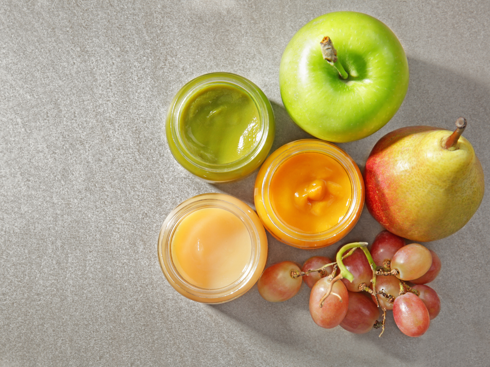

Coincidência ou não, o Dia das Crianças (12 de outubro) e o Dia Mundial da Alimentação (16 de outubro) são celebrados e lembrados com poucos dias de diferença. E não é novidade que a alimentação infantil é um tema que precisa ser discutido. Em especial, o vilão de uma alimentação saudável e o mais amado pelas crianças (e até adultos) é pauta dos nutricionistas, médicos e cientistas de todo o mundo. Mas afinal, quando se pode introduzir o açúcar na alimentação de uma criança?

De acordo com o [Fundo das Nações Unidas para a Infância (UNICEF), o leite materno é tudo que um bebê precisa nos seus primeiros seis meses de vida](https://www.unicef.org/brazil/aleitamento-materno). Após este período, deve ser dada alimentação complementar apropriada, mas a amamentação deve ser continuada até os dois anos ou mais.

Porém, a partir dos seis meses quais alimentos podem ser oferecidos? E qual é a quantidade ideal de açúcar que a criança pode ingerir diariamente?

Antes de falarmos sobre essa alimentação complementar ao leite materno, devemos relembrar que **a amamentação é muito importante tanto para a mãe quanto para o bebê**. Para saber mais sobre os [mitos, verdades e importância da amamentação, confira nosso post sobre o Agosto Dourado](https://blog.healthbit.com.br/como-amamentar-mitos-e-verdades-sobre-o-aleitamento-materno).

## Importância da alimentação complementar

Segundo uma cartilha [sobre a alimentação da criança criada pelo Ministério da Saúde](https://bvsms.saude.gov.br/bvs/publicacoes/saude_crianca_aleitamento_materno_cab23.pdf), essa **alimentação complementar dada após o seis meses de vida do bebê deve fornecer quantidades suficientes de água, energia, proteínas, gorduras, vitaminas e minerais**.

A partir deste momento, a criança começa a desenvolver o paladar e definir preferências alimentares. Por isso, é muito importante apresentar e reapresentar alimentos para a criança, mesmo que ela não goste, pois **uma criança precisa experimentar um novo sabor entre 8 a 10 vezes antes de aceitá-lo**.

Conforme a criança vai ficando mais velha, ela passa a lidar melhor com diversos tipos de alimentos e até a se alimentar sozinha. Por exemplo, já é possível que um bebê de seis meses seja alimentado com sólidos por uma colher; a partir dos nove meses, ele consegue segurar o copo com as duas mãos e comer alimentos mais sólidos, porém, cortados; e a partir do seu primeiro ano, consegue comer alimentos semi-sólidos e a se alimentar sozinho.

**“Entretanto, deve ser lembrado que essas idades são somente indicações, pois cada criança tem seu ritmo e necessidades de alimentação”**, explica Joana Tomás, nutricionista da HealthBit.

A Joana ainda deu algumas dicas:

- A textura e consistência dos alimentos deve ser adaptada ao desenvolvimento de cada bebé, garantindo que há uma progressão adequada neste sentido;
- A introdução de alimentos sólidos ou grumosos deve ser feita entre os 8 e os 10 meses de idade. Caso contrário, poderá haver um aumento da seletividade alimentar e redução do consumo de alguns grupos de alimentos, tais como frutas e verduras;
- Há estudos que sugerem que um início precoce da diversificação alimentar (abaixo dos 6 meses de idade), aumentam o risco de obesidade posterior. Como tal, não se recomenda o início da alimentação complementar antes deste período;
- Até, pelo menos, aos 6 meses de idade deve manter-se o aleitamento materno exclusivo. Caso esta opção não seja viável, a par com o(a) Pediatria ou profissional de saúde que acompanha a criança, pode recorrer-se às fórmulas infantis;
- É desaconselhada a adição de sal e açúcar no momento da diversificação alimentar;
- O mel não deve ser oferecido antes dos 12 meses de idade;
- O funcho, em chá ou óleo (utilizado para o alívio das cólicas abdominais) são desaconselhados antes dos 4 anos de idade, por não haver informação concreta acerca da segurança da utilização dos mesmos;
- As bebidas de arroz não devem ser fornecidas a bebês ou crianças pequenas, como forma de reduzir a exposição ao arsênio inorgânico;
- O leite de vaca não deve ser oferecido como bebida principal antes dos 12 meses de idade, embora possam ser adicionados pequenos volumes aos alimentos complementares. Quando oferecido em grandes quantidades, fornece excesso de proteína, gordura e energia.

**Já que neste período de alimentação complementar ao leite materno é aconselhável ainda não fornecer açúcar, quando isso pode ser feito?**

## Introdução do açúcar na alimentação da criança

De acordo com dados do Ministério da Saúde, apenas 60% dos bebês entre 6 meses e 2 anos consomem verduras e legumes e **43% deles já consomem sucos industrializados e 48% tomam refrigerante**. Isso significa que as crianças estão ingerindo açúcares cada vez mais cedo por meio das bebidas industrializadas.

**A preocupação com esse dado acontece porque uma grande ingestão de açúcares, no futuro, pode desenvolver doenças como diabetes e hipertensão que possuem diversas complicações.**

A Associação Americana do Coração afirma que **a ingestão de bebidas adoçadas artificialmente, como refrigerantes e sucos industrializados, no primeiro ano de vida está associada ao maior risco de desenvolver obesidade aos 6 anos de idade. Além disso, mais de 30% das crianças de 5 a 9 anos do Brasil estão acima do peso**.

Reforçando esses pontos e respondendo à pergunta principal, a [Sociedade Brasileira de Pediatria](https://saude.abril.com.br/familia/adocante-na-infancia/) **recomenda que açúcares industrializados e adoçantes não sejam oferecidos para a criança antes dela complementar 2 anos de vida**. Pois, de acordo com uma nutróloga da sociedade, como antes dos dois anos o paladar está se desenvolvendo, se o açúcar é inserido neste momento, o bebê se acostuma com esse sabor. Assim, recomenda-se que a ingestão de açúcar seja feita de forma natural, por meio de frutas e leite.

E, mesmo quando forem dados, eles não devem ultrapassar 10% da ingestão calórica diária. Entretanto, para se ter um ponto de partida mais geral, a **Associação Americana do Coração recomenda uma ingestão diária de açúcar de cerca de 25 gramas.**

Antes que pense que isso é difícil de ser alcançado, lembre-se que somente em uma lata de Pepsi são encontrados 34,98 gramas de açúcar, ou seja, quase 10 gramas a mais do que é recomendado para o dia inteiro.

Para confirmar mais ainda essa questão, o levantamento Nutri Brasil Infância II, coordenado pela Associação Brasileira de Nutrologia (Abran), mostrou que **no Centro-Oeste as crianças consomem 21 gramas de açúcar só no lanche da tarde**.

Devemos lembrar que sim, nosso corpo precisa de açúcar. Porém, quando só tem ele, sem ser acompanhado de outros nutrientes, ele é considerado uma fonte de caloria vazia. Por isso, é muito importante mesmo quando começar a introduzir o açúcar, e qualquer outro alimento, ensinar e incentivar que a criança pratique um consumo consciente de todos os alimentos.

E depois de todas essas informações, como garantir uma alimentação infantil saudável? [O Guia Alimentar para Crianças Brasileiras menores de 2 anos](http://189.28.128.100/dab/docs/portaldab/publicacoes/guia_da_crianca_2019.pdf), desenvolvida pelo Ministério da Saúde, te ajuda com doze passos para isso, que são:

1. Amamentar até os dois anos ou mais, oferecendo somente o leite materno até 6 meses
2. Oferecer alimentos in natura ou minimamente processados, além do leite materno, a partir dos 6 meses
3. Oferecer água própria para o consumo à criança em vez de sucos, refrigerantes e outras bebidas açucaradas
4. Oferecer a comida amassada quando a criança começar a comer outros alimentos além do leite materno
5. Não oferecer açúcar nem preparações ou produtos que contenham açúcar à criança até 2 anos de idade
6. Não oferecer alimentos ultraprocessados para a criança
7. **Cozinhar a mesma comida para a criança e para a família**
8. Zelar para que a hora da alimentação da criança seja um momento de experiências positivas, aprendizado e afeto junto da família
9. Prestar atenção aos sinais de fome e saciedade da criança e conversar com ela durante a refeição
10. Cuidar da higiene em todas as etapas da alimentação da criança e da família
11. Oferecer à criança alimentação adequada e saudável também fora de casa
12. Proteger a criança da publicidade de alimentos

Aqui na HealthBit temos uma super preocupação com a nutrição infantil, sendo esta a nossa principal atuação em Portugal: ajudando, com a orientação da nutricionista Joana Tomás, creches a oferecerem uma alimentação saudável e equilibrada para as crianças.

Fique sempre de olho no nosso blog para saber mais informações e dicas sobre alimentação e saúde! 