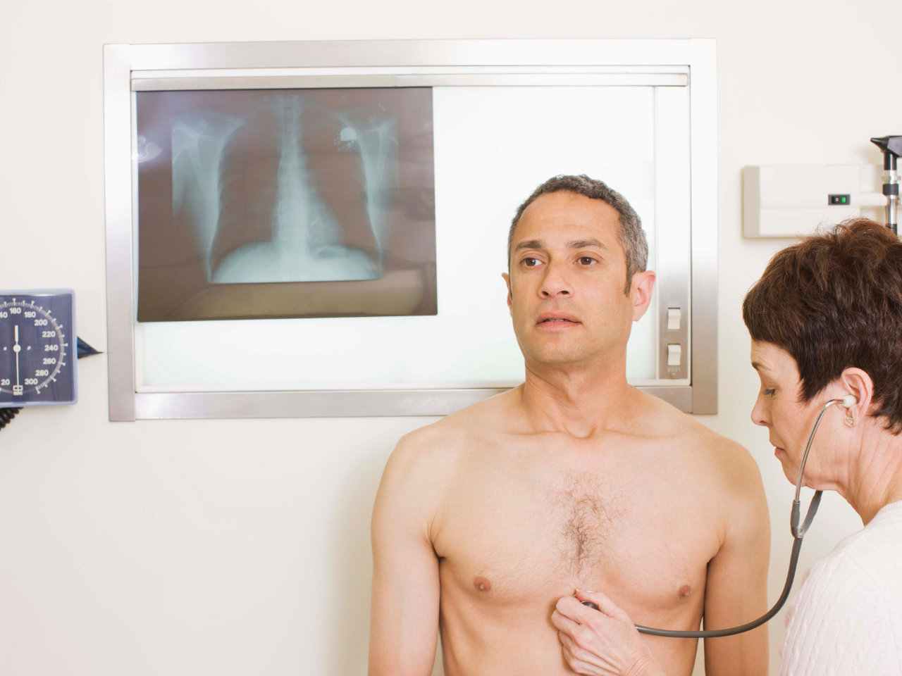

A campanha Novembro Azul, foca na conscientização para o cuidado da saúde do homem e, principalmente, para a atenção deles a respeito do câncer de próstata. A primeira campanha aconteceu na Austrália em prol da conscientização da saúde masculina. Hoje, ela apresenta relevância mundial, tamanha a sua importância com o passar dos anos.

É muito importante falar sobre o câncer de próstata porque esta é a segunda principal causa de morte por câncer em homens, atrás somente do câncer de pulmão. De acordo com o [Instituto Nacional de Câncer (INCA)](https://www.inca.gov.br/numeros-de-cancer), **somente em 2020 houve 65.840 novos casos de câncer de próstata, no Brasil**.

O destaque para o cuidado integral com a saúde do homem também acontece porque segundo um estudo realizado pelo Centro de Referência em Saúde do Homem de São Paulo, 70% das pessoas do sexo masculino que procuram por ajuda de profissionais de saúde têm influência de mulheres ao redor ou dos filhos e filhas e mais da metade deles **adiam tanto as consultas médicas que chegam ao consultório com doenças em estágio avançado**.

Pensando nesses pontos, decidimos reunir aqui tudo que é preciso saber sobre o Novembro Azul, o câncer de próstata e o cuidado da saúde dos homens.

## Câncer de próstata

De [acordo com o INCA](https://www.inca.gov.br/tipos-de-cancer/cancer-de-prostata), este tipo de câncer é considerado como de “terceira idade”, por conta de 75% dos casos no mundo ocorrem a partir dos 65 anos. Na grande maioria dos casos, os tumores crescem de forma lenta, levando cerca de 15 anos para atingir 1 cm, e acabam **não dando sinais dele durante a vida do homem e nem ameaçam sua saúde**.

Porém em casos avançados, ele pode crescer rapidamente e se espalhar por outros órgãos, levando à morte. Segundo o [Atlas de Mortalidade por Câncer](https://www.inca.gov.br/MortalidadeWeb/pages/Modelo03/consultar.xhtml;jsessionid=3CAAF50AD77762E9F9781CEC4C702BEA#panelResultado), **em 2018, houve 15.576 mortes por conta do câncer de próstata**.

### O que aumenta o risco de ter o que previne o câncer

Na [cartilha “Câncer de Próstata: vamos falar sobre isso?”](https://central3.to.gov.br/arquivo/494609/), desenvolvida e disponibilizada pelo INCA, são indicados alguns fatores que podem aumentar o risco de tê-lo:

- O risco aumenta conforme a idade vai avançando, pois, no Brasil, a cada 10 pessoas diagnosticadas com câncer de próstata, 9 possuem mais de 55 anos;
- Famílias em que alguém teve câncer antes dos 60 anos;
- Doenças crônicas: diabetes, hipertensão e obesidade;
- **Estilo de vida: tabagismo, sedentarismo, alimentação inadequada, consumo excessivo de álcool.**

Além disso, a cartinha ainda mostra algumas atividades que podem prevenir a chance de desenvolvimento do câncer, sendo elas:

- Ter uma alimentação saudável;
- Manter o peso corporal adequado;
- Praticar atividade física;
- Não fumar;
- Evitar o consumo de bebidas alcoólicas.

**Lembre-se que adotar práticas e hábitos de vida saudável diminui o risco de várias doenças.**

### Quais sintomas podem aparecer caso eu esteja com câncer de próstata?

Muitos pacientes não apresentam qualquer sintoma na fase inicial da doença, e quando apresentam eles são semelhantes aos do crescimento benigno da próstata. Sendo os sintomas:

- Dor, queimação ou dificuldade de urinar;
- Jato urinário fraco;
- Demora em começar ou terminar de urinar;
- Necessidade frequente de urinar durante o dia e/ou noite;
- Sangue na urina ou no sêmen;
- Ejaculação dolorosa.

Por mais que essas possam ser algumas doenças, elas são indicativos de nem tudo está certo no seu corpo, então, **se apresentar qualquer um desses sintomas, procure uma unidade ou profissional de saúde**. Principalmente porque detectar o câncer em sua fase inicial **permite que exija uma maior chance de tratamento**.

### Como descobrir o câncer e quais os tipos de tratamento?

Os exames para identificar o câncer de próstata devem ser feitos por todos homens a partir dos seus 50 anos de idade e a partir dos 40 anos para aqueles que já possuem casos da doença na família.

Para detectar o câncer existem dois exames que podem ser feitos e, além desses, a biópsia pode ser realizada, já que é o único exame que realmente confirma o câncer.

**1. Exame de Sangue PSA**: significando Antígenos Específicos da Próstata, em português, este exame de sangue serve para medir a quantidade de proteína ou moléculas produzidas pela próstata. Níveis acima dos considerados normais, ou seja até 4,0 ng/mL, podem significar câncer ou outras doenças;

**2. Toque retal**: conhecido popularmente como exame de toque ou exame de próstata, este exame consiste em uma análise feita pelo médico, por meio do toque. Com o dedo, em uma luva lubrificada, o médico irá apalpar as partes posteriores e laterais da próstata para investigar alguma alteração, como nódulo ou área endurecida tida como suspeita, que podem indicar uma fase inicial do câncer. O toque retal é rápido e, geralmente, não causa dor, apenas um leve desconforto durante o procedimento. O exame é extremamente simples e muito eficaz para detectar o câncer de próstata, em conjunto com o exame de PSA;

**3. Biópsia: caso em alguns dos exames anteriores exista alguma alteração e exista uma possibilidade de realmente se ter câncer, o médico pode pedir a biópsia. Nela, são retiradas pequenas amostras do tecido da glândula, para ser analisada em laboratório. O procedimento é feito com o auxílio de um ultrassom, e poderá ser aplicada uma leve anestesia local no paciente. O médico também poderá receitar medicamentos para prevenir possíveis infecções.**

### A importância dos homens cuidarem de sua saúde

De acordo com dados do [Instituto Brasileiro de Geografia e Estatística (IBGE)](https://g1.globo.com/ciencia-e-saude/noticia/2019/02/05/expectativa-de-vida-por-que-as-mulheres-vivem-mais-do-que-os-homens.ghtml), em 2019, **a expectativa de vida ao nascer das mulheres é de 80, enquanto a dos homens é 73 anos**.

Essa informação por si só já causa uma preocupação a respeito da saúde dos homens, mas outros dados chamam ainda mais a atenção, pois a cada 5 pessoas que morrem entre 20 e 30 anos, 4 são homens e a cada 3 mortes de adultos, 2 são de homens.

Tudo isso se intensifica quando se relembra o dado apresentado no início do post que 70% das pessoas do sexo masculino que procuram por ajuda de profissionais de saúde têm influência de mulheres ao redor ou dos filhos e filhas e mais da metade deles **adiam tanto as consultas médicas que chegam ao consultório com doenças em estágio avançado**.

[Quando os homens são questionados](https://www.scielo.br/pdf/sausoc/v22n2/v22n2a13.pdf) o porquê isso acontece **eles citam a dificuldade de se ausentar do trabalho para irem às consultas e a falta de unidades específicas voltadas ao atendimento dos problemas da saúde masculina**.

Além disso, o cuidado com a própria saúde e com a saúde dos demais não são questões colocadas como parte da vida social do homem, pois existe uma construção histórica que determina esse tipo de cuidado como “feminino”. Essa ideia de que o homem precisa “ser homem”, ser forte, também é uma construção histórica e está ancorada no conceito de masculinidade.

Essa construção reforça a falta de autocuidado que os homens têm, pois está associada à resistência à doença, às práticas sexuais de risco (pelo maior número de parceiras, identificação de uma falsa autoproteção e associação entre masculinidade e virilidade), e ao papel de provedor e trabalhador inesgotável. Essa concepção leva, por vezes, a assumir tarefas mais perigosas e a tomar menos medidas de proteção individual.

Lembre-se: não importa o tipo de homem que você é. Seja do tipo que cuida da saúde!

E fique ligado no #BlogHbit para mais informações sobre como cuidar da sua saúde e a de seus colaboradores. 