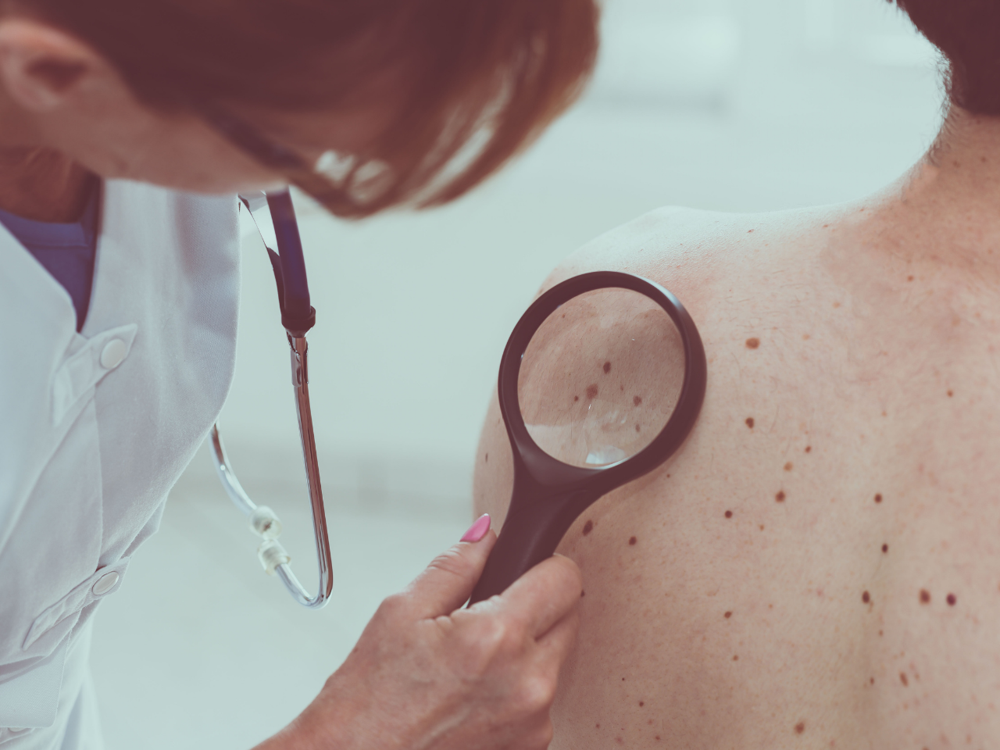
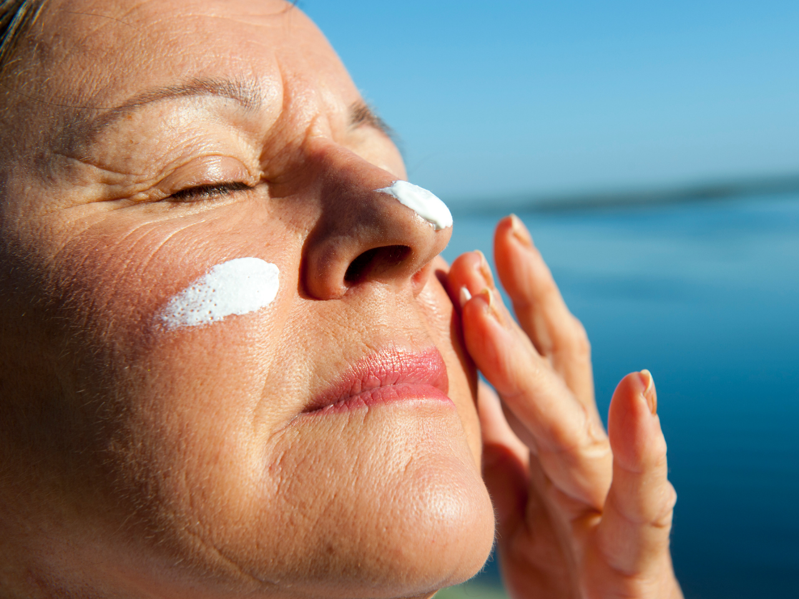

Você sabia que o câncer de pele não melanoma é o tipo de tumor mais comum na população? De acordo com o Instituto Nacional de Câncer (INCA), a expectativa do número total de novos casos deste tipo de câncer em 2020 é de 176.930, sendo 83.770 homens e 93.160 mulheres. É por isso que Dezembro, bem no mês que inicia o verão, foi escolhido para alertar para a prevenção do câncer de pele.

Dezembro Laranja é uma campanha criada pela [Sociedade Brasileira de Dermatologia](https://www.sbd.org.br/dezembroLaranja) com o objetivo de prevenir o câncer de pele, que é o tumor de maior incidência no Brasil. O laranja foi escolhido porque a cor lembra o Sol e até o tom dos corpos bronzeados… e há 7 anos também simboliza a luta contra o câncer da pele.

**O câncer de pele corresponde a 30% de todos os tumores malignos do país**, porém, possui um alto potencial de cura se for diagnosticado e tratado precocemente. Entre os tipos de câncer de pele este é o de menor mortalidade - dados do Atlas de Mortalidade por Câncer indicam que, em 2018, houveram 2.329 mortes por conta deste câncer. Porém, se não tratado adequadamente pode deixar mutilações bastante expressivas.

Por mais comum que seja, é sempre preciso reforçar quais os fatores de risco e como se prevenir do câncer de pele. Então, hoje, no #BlogHbit vamos falar sobre essas questões.

## 8 dúvidas e respostas sobre o câncer de pele

1. ## Quais são os tipos de câncer de pele?

A [Sociedade Brasileira de Dermatologia (SBD)](https://www.sbd.org.br/dermatologia/pele/doencas-e-problemas/cancer-da-pele/64/) fala sobre três tipos de câncer de pele, que são:

### Carcinoma basocelular (CBC)

É o tipo de câncer que surge na camada mais profunda da epiderme, ou seja, a camada superior da pele e o mais prevalente. Possui baixa letalidade e pode ser curado quando ocorre a detecção precoce.

Normalmente, surge em áreas que ficam mais expostas ao sol, como rosto, orelhas, pescoço, couro cabeludo, ombros e costas, mas, em casos raros, pode surgir em áreas que não são expostas ao sol.

Os sintomas deste tipo de câncer podem se assemelham a lesões não cancerígenas, como eczema ou psoríase, mas o mais comum é um nódulo-ulcerativo, que se traduz como uma pápula vermelha, brilhosa, com uma crosta central, que pode sangrar com facilidade.

### Carcinoma espinocelular (CEC)

Este tipo se apresenta nas células escamosas, que são as que constituem a maior parte das camadas superiores da pele e é duas vezes mais comum em homens do que em mulheres.

Normalmente, é mais comum de se desenvolver nas áreas que ficam mais expostas ao sol, mas também podem surgir em todas as partes do corpo.

A exposição excessiva ao sol é a principal causa do CEC, mas alguns casos são relacionados a feridas crônicas e cicatrizes na pele, uso de drogas anti rejeição de órgãos transplantados e exposição a certos agentes químicos ou à radiação.

Os sintomas, geralmente, têm coloração avermelhada e se apresentam na forma de machucados ou feridas espessos e descamativos, que não cicatrizam e sangram ocasionalmente, podendo parecer muito com verrugas.

### Melanoma

É o tipo de câncer de pele menos comum e com o mais alto índice de mortalidade. Porém, as chances de cura são maiores do que 90% quando acontece o diagnóstico precoce.

Têm, normalmente, a aparência de uma pinta ou de um sinal na pele, em tons acastanhados ou enegrecidos. Porém, esse sinal pode mudar de cor, de formato ou de tamanho e causar sangramento, podendo surgir em áreas difíceis de serem visualizadas pelo paciente, embora sejam mais comuns no pescoço, rosto, pernas e troncos.

2. ## O que pode aumentar o risco

Alguns dos fatores que podem aumentar o risco de se ter o câncer de pele são:

- Exposição prolongada e repetida ao sol (raios ultravioletas - UV), principalmente na infância e adolescência;
- Ter pele e olhos claros, com cabelos ruivos ou loiros, ou ser albino;
- Ter história familiar ou pessoal de câncer de pele;
- Outros fatores de risco incluem indivíduos com sistema imune debilitado e exposição à radiação artificial.

3. ## Como posso me prevenir?

A proteção solar é a principal forma e pode ser feita através de:

- Evitar o sol nos horários entre as 10 e 16 horas;
- Evitar o sol em excesso;
- Evitar câmaras de bronzeamento artificial;
- Use protetor solar com Fator de Proteção Solar (FPS) no mínimo 15;
- Usar filtro solar próprio para os lábios;
- Reaplique o protetor a cada 2-3h – até mesmo aqueles que são “à prova d’água”;
- Aplique o protetor solar cerca de 30 minutos antes de se expor ao sol;
- Além do protetor solar utilize bonés, chapéus, roupas compridas, óculos escuros e procure sempre lugares com sombra;
- Observar regularmente a própria pele, à procura de pintas ou manchas suspeitas;
- Manter bebês e crianças protegidos do sol. Filtros solares podem ser usados a partir dos seis meses;
- Consultar um dermatologista uma vez ao ano, no mínimo, para um exame completo.

4. ## Quais são os sinais e sintomas do câncer?

Segundo o INCA, este tipo de câncer de pele ocorre principalmente nas áreas do corpo que ficam mais expostas ao sol, como o rosto, pescoço e orelhas. Os sintomas podem ser:

- Manchas na pele que coçam, ardem, descamam ou sangram.
- Feridas que não cicatrizam em até quatro semanas
- Mancha vermelha
- Nódulo ou ferida que sangra ou forma crosta

5. ## Como é feito o diagnóstico?

Quando uma pessoa apresenta algum dos sintomas é indicado que ela procure um dermatologista pois ele é o especialista apropriado para realizar o exame clínico para identificar se realmente é câncer.

6. ## Existem tratamentos? Quais são?

Sim, existem! De acordo com o INCA, **as formas de tratamento são diferentes para cada tipo de câncer de pele existente**. Para os dois tipos mais comuns, carcinoma basocelular e carcinoma epidermoide, a cirurgia é o tratamento mais indicado. E, com o passar do tempo, a cirurgia pode se associar à radioterapia.

Existe também a terapia fotodinâmica, que utiliza um creme fotossensível e depois faz uma aplicação de uma fonte de luz, que é uma opção terapêutica para a ceratose actínica (lesão que aparece antes do câncer de pele), carcinoma basocelular superficial e carcinoma epidermoide "in situ" (Doença de Bowen).

Claro que também existem mais opções de tratamento de câncer e o tratamento específico para o tipo de câncer deve ser feito por um especialista.

7. ## A terceira idade é a mais afetada?

De acordo com a Sociedade Brasileira de Dermatologia, há cada vez mais uma concentração de casos de câncer não melanoma entre pessoas próximas dos 70 anos de idade, causada pelo avanço da expectativa de vida da população e, consequentemente, da exposição ao sol sem proteção ao longo dos anos.

O câncer não melanoma é uma versão menos agressiva da doença, potencialmente curável, mas é o mais comum no país e pode deixar cicatrizes em razão da necessidade de remover as lesões na pele para tratamento.

8. ## Detecção precoce realmente ajuda?

Segundo o INCA, **quanto mais precoce for a identificação do câncer, melhores serão os resultados do tratamento**. Sendo assim isso, ajuda e muito uma detecção precoce para se iniciar o tratamento antes e ter resultados melhores além de adquirir menos sequelas.

Por conta disso, é recomendado que se suspeite de qualquer mudança persistente na pele e que seja um sintoma já citado antes.

Se tiver algum desses sintomas, deve-se procurar um especialista para identificação e tratamento, caso realmente seja câncer. **Conheça seu corpo e esteja atento a qualquer mudança na sua pele.**

Acompanhe nossas redes sociais e no #BlogHbit para mais posts sobre questões importantes de saúde. 