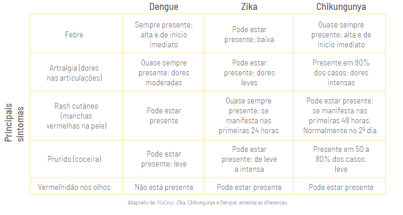

Dia 21 de dezembro começa o verão e com ele o aumento de casos das chamadas “doenças de verão”, tais como **dengue, zika e chikungunya**. Em 2019, segundo o Ministério da Saúde, houve um **aumento de 488% em casos de dengue e de 248%** se considerarmos todas as doenças relacionadas ao mosquito Aedes Aegypti, em relação ao ano de 2018.

Esse aumento ocorre por conta do aumento das chuvas, causando um maior número de focos de água parada, lugar onde o mosquito Aedes Aegypti, transmissor da dengue, zika e chikungunya, deposita seus ovos para nascerem as larvas. Esse mosquito é bem parecido com um pernilongo, com a diferença de ter listras brancas em todo seu corpo.

Este ano, justamente por conta do novo coronavírus, muitas pessoas podem esquecer os perigos dessas doenças que podem levar a óbito. De acordo com o Ministério da Saúde, das Semanas Epidemiológicas de 29 de dezembro de 2019 (SE 1) a 19 de setembro de 2020 (SE 38), foram notificados 931.903 casos prováveis de dengue no país. Esses dados mostram que **até a SE 11, a curva epidêmica dos casos prováveis em 2020 ultrapassou o número de casos do mesmo período para o ano de 2019**.

## Sintomas

Os sintomas dessas três doenças são muito semelhantes e podem ser:

- Febre;
- Dores nas articulações;
- Manchas vermelhas pelo corpo;
- Coceira;
- Vermelhidão nos olhos;
- Mal estar e falta de apetite;
- Dor no fundo dos olhos;
- Dor de cabeça:
- Dores musculares;

E também tem os sinais de alerta que são:

- Dor abdominal intensa e contínua;
- Sangramentos na boca ou nariz;
- Vômitos persistentes.

Para diferenciar melhor quais sintomas são mais comuns para cada doença, nosso time de saúde adaptou o [conteúdo publicado pela Fiocruz para diferenciá-las](https://agencia.fiocruz.br/zika-chikungunya-e-dengue-entenda-diferen%C3%A7as), nesta tabela super informativa:

Alguns desses sintomas, como febre, dores de cabeça e dores no corpo, são similares entre si e até mesmo iguais aos da infecção pelo Covid-19, por isso, **não realize automedicação sem uma avaliação por profissional de saúde**.

Caso apresente qualquer sintoma: busque um serviço de saúde para realizar o diagnóstico!

## Diagnóstico

O diagnóstico dessas doenças pode ser feito por meio de anamnese, que é uma entrevista feita pelo profissional de saúde ao paciente, exames clínicos e laboratoriais específicos, como o de hemograma e a prova do laço, um exame rápido que visa analisar a fragilidade dos vasos sanguíneos que ocorre quando se é contaminado pela dengue.

Atualmente, também existe o teste rápido para dengue, que coleta um pouco de sangue para detectar o vírus, mas nem sempre ele é necessário, pois o diagnóstico pode ser feito apenas pela anamnese e avaliando o quadro clínico.

## Prevenção

As principais formas de prevenção são evitar ser picado pelo mosquito e evitar a proliferação dele, com práticas cotidianas, tais como:

- Usar repelente diariamente;
- Eliminar focos de água parada;
- Usar preservativo, principalmente durante a gravidez, para evitar a transmissão da zika, que pode causar microcefalia (cérebro e/ou cabeça do bebê menores do que de outras crianças sem contato com o vírus) e a Síndrome de Guillain Barré (síndrome neurológica que pode levar à morte).

**Caso você veja um foco de água parada em terrenos baldios ou em lixos acumulados na rua, denuncie à Secretaria Municipal de Saúde**, que irá remover os focos que a população não consegue eliminar.

## Tratamento

Para casos leves, o tratamento recomendado é manter-se hidratado e repousar. Porém, alguns casos de todas essas doenças podem ser graves e necessitar de outras formas de tratamento, indicadas pelo profissional de saúde, por isso: **procure sempre o serviço de saúde em caso de sintomas**.

Justamente por conta do novo coronavírus, as pessoas estão se esquecendo da importância de se proteger de outras doenças e, inclusive, tendem a não perceber os sintomas por poderem ser muito parecidos com a Covid-19. Por isso, preste atenção aos focos de água parada e vá imediatamente ao serviço de saúde caso apresente qualquer um dos sintomas.

Para se informar sobre essas e outras doenças, fique ligado no #BlogHBit e nas nossas redes sociais!