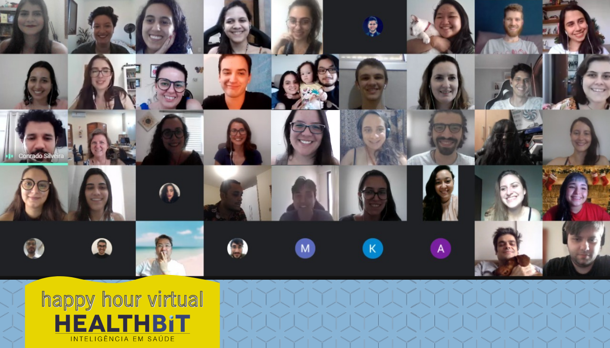

Dois mil e vinte foi um ano nada fácil. Covid-19 foi mudando os lugares, as pessoas e as culturas por onde passava. Antes mesmo de chegar de vez no Brasil, mudou tudo por aqui: a HealthBit se transformou numa startup com trabalho 100% remoto. Inicialmente por alguns dias e agora por tempo indeterminado.

Mas se engana quem pensa que 2020 foi um ano perdido! Apesar dos pesares, com certeza alguma coisa você aprendeu por aí. Do lado de cá crescemos nosso time e em meio a pandemia mundial **escapamos de medidas difíceis para muitas empresas como a redução da carga horária e/ou salário e desligamento de colaboradores**.

Indo contra a corrente da pandemia, também crescemos (e muito!). Este foi o ano que mais contratamos colaboradores: **foram 20 novos talentos** que agora integram os times de Comunicação, Saúde, Dados, Desenvolvimento e logo mais teremos mais um para o Administrativo.

**Criamos fluxos personalizados e Células de Trabalho de Covid-19 que atendem aos nossos clientes de forma exclusiva e única**, de acordo com a necessidade de cada um em meio às mudanças constantes e novas descobertas. Hoje são mais de 300 mil vidas monitoradas focadas em Covid-19. Além disso, cuidamos de mais de um milhão de vidas de mais de 100 empresas diferentes ao redor do Brasil.

Como você já sabe, **a HealthBit trabalha para levar saúde para todos, evitar casos graves e sofrimentos desnecessários**, causando um impacto social relevante não apenas para os diretamente envolvidos com a nossa empresa, mas para todas as pessoas afetadas no setor de saúde.

Conseguimos isso graças a cada um dos integrantes da nossa equipe. Do financeiro à saúde, passamos pelos times de desenvolvimento, jurídico e dados, além de DHO e comunicação. Todo mundo aqui faz parte e ajuda a levar saúde para todos.

Sabemos que nossos colaboradores são peças importantes na empresa e cuidamos de cada um com muito carinho. No começo da pandemia contamos aqui as ações que [adotamos para preservar a saúde mental do nosso time](https://blog.healthbit.com.br/pandemia-como-a-HealthBit-esta-cuidando-da-saude-mental-dos-funcionarios), mas a verdade é que fomos muito além disso! As campanhas de [Setembro Amarelo](https://blog.healthbit.com.br/por-que-setembro-amarelo-e-importante-para-minha-empresa), [Outubro Rosa](https://blog.healthbit.com.br/como-posso-apoiar-outubro-rosa) e [Novembro Azul](https://blog.healthbit.com.br/tudo-sobre-novembro-azul) também foram lembradas e trabalhadas internamente (além, é claro, das ações nos clientes).

Durante todo o ano mantivemos nossas rodas de conversa para aliviar a tensão do aumento de casos de Covid-19 pelo mundo e matar a saudade do time. Não nos encontramos fisicamente em nenhum momento desde março de 2020, mas finalizamos o ano mantendo a tradição de brindar os progressos e traçar metas e objetivos para o próximo ano.

O bate-papo e brinde de final de ano foram virtuais, mas não faltaram risadas e boas histórias!

E por conta disso, queremos agradecer todo e cada colaborador que fez parte dessa evolução da HealthBit no meio da pandemia. Que fez a diferença com o seu trabalho, cuidado, atenção, inovação, ideias e sendo ele mesmo. Pois, entendemos que mais do que o nosso trabalho, o grande diferencial da HealthBit são os colaboradores que o fazem da maneira que o fazem.

Mesmo com as dificuldades e sem a presença física, agradecemos 2020, enquanto esperamos 2021, pois as perspectivas para ele são ótimas! Talvez Covid-19 ainda esteja por aqui, mas descobrimos novas habilidades e estamos com um time que melhora a cada dia.