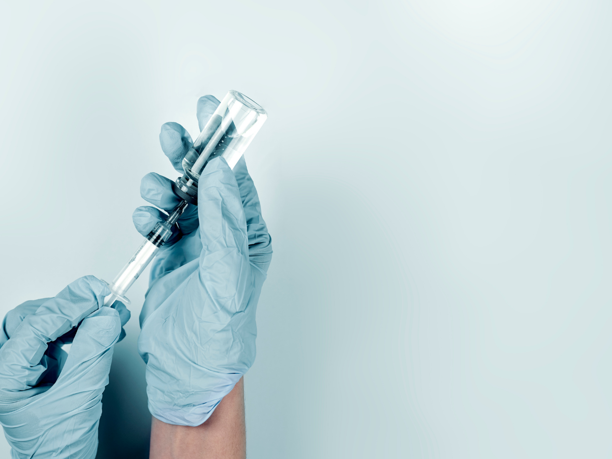
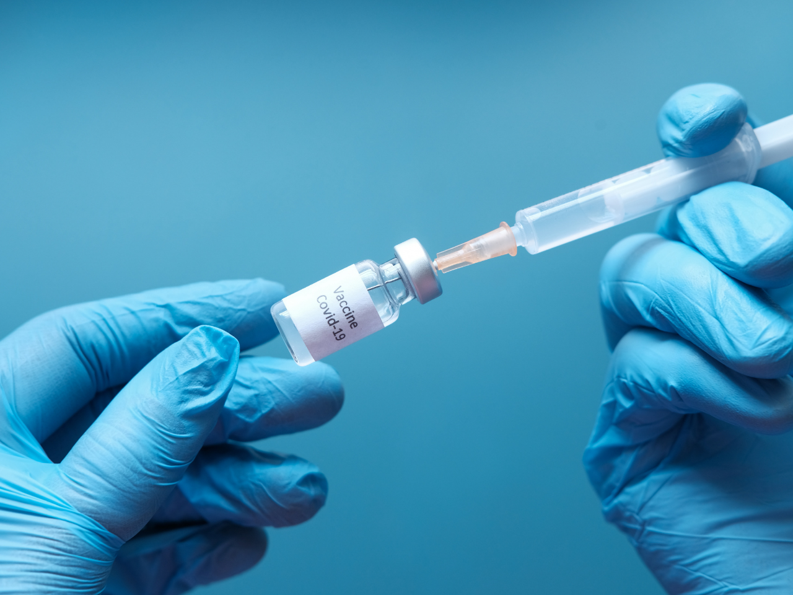
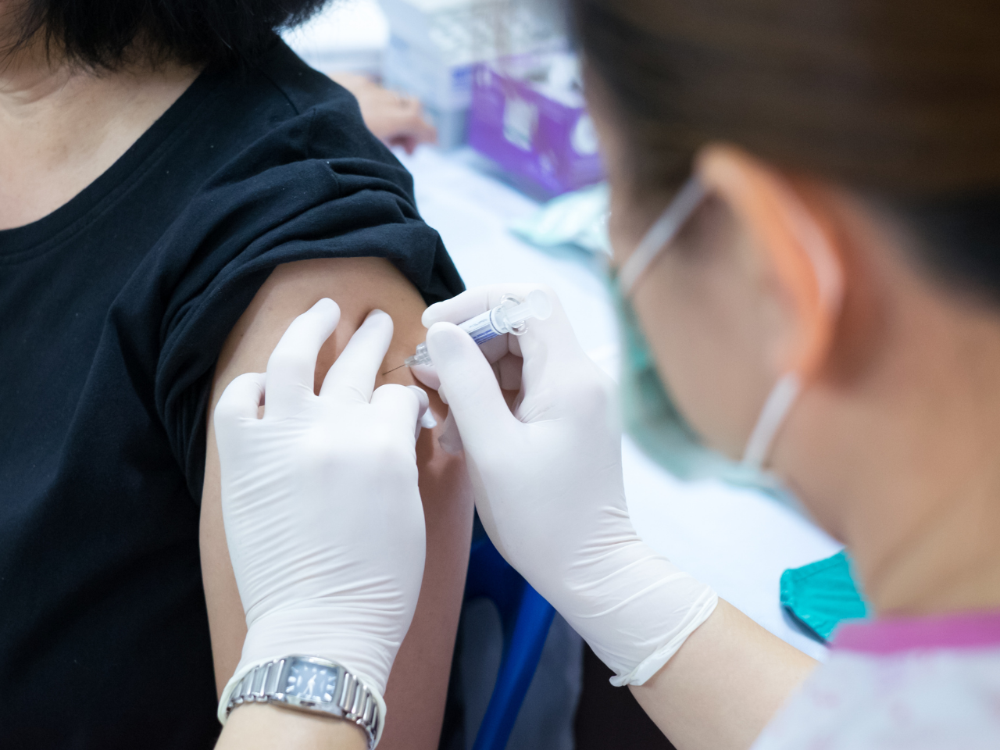

Com as notícias que anunciaram a aprovação das vacinas CoronaVac e a da Universidade de Oxford contra a Covid-19 no Brasil, a atenção de todo o país se voltou para este tema e, principalmente, o porquê é tão importante manter a carteira de vacinação atualizada.

[Dados coletados pela Clalit Health Services](https://exame.com/ciencia/infeccao-por-covid-19-diminuiu-apos-1a-dose-de-vacina-sugerem-dados-de-israel/), uma das maiores organizações de saúde de Israel, mostrou que 14 dias após a primeira dose da vacina contra a Covid-19 **houve uma queda de 33% de infecção entre aqueles que foram vacinados**, em comparação com o resto da população.

A vacinação é uma das formas mais importantes para a proteção de diversas doenças, inclusive daquelas que podem levar à morte. De acordo com [estimativas de pesquisadores da Organização Mundial da Saúde (OMS)](https://www.bbc.com/portuguese/internacional-54029641), **a vacinação em massa evita de 2 a 3 milhões de mortes anualmente e gera uma economia equivalente a R$250 milhões por dia**.

O **Brasil é citado como referência mundial em imunização por meio das vacinas pela Organização Pan-Americana da Saúde (OPAS), braço da OMS**, por conta do [Programa Nacional de Imunização (PNI)](https://bvsms.saude.gov.br/bvs/publicacoes/livro_30_anos_pni.pdf), iniciado no país em 1973, que tem como objetivo criar um modelo de ação para a vacinação.

Porém, nos últimos anos, foi percebida uma queda no número de pessoas vacinadas. [Desde 2017, as duas primeiras doses da tríplice viral em crianças não alcançaram os 95%](https://oglobo.globo.com/sociedade/saude/na-sombra-da-covid-19-sarampo-avanca-provoca-mortes-no-brasil-por-falta-de-vacinacao-24844745) de cobertura necessários para deixar a população protegida. No geral, analisando todas as vacinas, **em 2020, a meta de vacinação no Brasil todo atingiu somente 65,5%**.

O [Ministério da Saúde](https://revistapesquisa.fapesp.br/as-razoes-da-queda-na-vacinacao/) acredita que a imunização tenha diminuído por cinco razões, entre elas a percepção enganosa dos pais de que não é preciso mais vacinar porque as doenças desapareceram e o medo de que as vacinas causem reações prejudiciais ao organismo.

Pensando nessas questões, neste post do #BlogHbit vamos falar sobre [como funcionam as vacinas, inclusive as novas contra a Covid-19 para relembrar a importância de se vacinar e, mais ainda, de manter a imunização atualizada](https://blog.healthbit.com.br/por-que-tao-importante-manter-carteira-vacinacao-atualizada#como-funcionam-vacinas).

## Como funcionam as vacinas?

As [vacinas](https://blog.healthbit.com.br/por-que-tao-importante-manter-carteira-vacinacao-atualizada) são substâncias biológicas que são introduzidas no corpo das pessoas de diversas formas, sendo os mais conhecidos por seringa e gotas, com o intuito de protegê-las de doenças.

De uma forma simples, elas ensinam o sistema imunológico a se proteger daquele vírus ou bactéria. Isso ocorre porque a maior parte das vacinas são compostas por toxinas, agentes que causam doenças e semelhantes.

Quando as vacinas trazem os próprios agentes agressores, podem existir duas versões: uma acentuada, com o vírus enfraquecido, e outra inativa, com o vírus inativo, ou seja, morto.

Assim, quando a vacina é aplicada e os agentes são injetados, o sistema imunológico da pessoa começa a criar defesas contra o vírus ou bactéria. Isso faz com que, quando a pessoa realmente for infectada pelo vírus, o sistema imunológico tenha a lembrança daquelas defesas e já saiba se defender, eliminando o agente e evitando a contaminação.

Na maioria dos casos, as vacinas podem causar reações leves como febre, dor no local e dores musculares.

## A produção e distribuição das vacinas

As vacinas no Brasil são produzidas em laboratórios nacionais, internacionais ou institutos especializados, como o Instituto Butantan. **Todas as vacinas passam por avaliações feitas pelo Instituto Nacional de Controle de Qualidade (INCQS)**, que pertence à Fundação Oswaldo Cruz (Fiocruz). E, caso elas sejam importadas, vindo de outro país, **elas têm que ser liberadas e aprovadas pela Agência Nacional de Vigilância Sanitária (ANVISA)**, como foi o caso das vacinas contra Covid-19.

Depois dessas fases, caso aprovadas, as vacinas são enviadas aos Estados, que são responsáveis por distribuí-las pelos municípios, de acordo com as necessidades e população do local. Para definir este número, cada Estado deve enviar, previamente, ao Governo Federal sobre a necessidade de doses para o local, avaliando o tamanho do público-alvo, a situação da doença na população e os estoques federais e estaduais.

A escolha de quais vacinas serão produzidas e distribuídas ocorre a partir do planejamento anual da Coordenação Geral do Programa Nacional de Imunização, no qual analisam a incidência da doença, agentes envolvidos e a capacidade de produção dos laboratórios.

## E as vacinas contra a Covid-19?

A questão de muitas pessoas terem medo de tomar vacina está influenciando, inclusive, na vacina contra a Covid-19, doença que ocorre por conta do novo coronavírus. De acordo com [uma pesquisa feita pelo Datafolha](https://g1.globo.com/bemestar/vacina/noticia/2020/12/12/datafolha-73percent-dizem-que-pretendem-se-vacinar-contra-a-covid-19-22percent-afirmam-que-nao.ghtml), aumentaram a quantidade de pessoas que pretendem não tomar as vacinas. Em agosto de 2020, **9% dos entrevistados afirmaram que não tomariam a vacina, enquanto em dezembro, 22% afirmaram que não tomariam**.

Mesmo a maioria das pessoas ainda afirmando que tomariam, isso é preocupante, principalmente, [porque a OMS estima](https://www.bbc.com/portuguese/geral-55749355) que entre 65% e 70% da população mundial precisarão estar imunes, ou seja, vacinadas, para que a transmissão seja interrompida.

E as duas vacinas aprovadas pela ANVISA no Brasil, a da Universidade de Oxford feita com a empresa Astra Zeneca e a Coronavac, nome popular da vacina produzida pela empresa chinesa Sinovac junto com o Instituto Butantan, no Brasil, **apresentaram eficácia geral de 70,4% e 50,4%, respectivamente. Ambas, acima do mínimo de 50%** [recomendado pela OMS](https://g1.globo.com/bemestar/vacina/noticia/2021/01/14/eficacia-da-coronavac-veja-perguntas-e-respostas.ghtml).

### Então, devo tomar a vacina? Ela é segura?

**Sim!** Ambas passaram por exames clínicos em humanos e não apresentaram efeitos significativos. E, mais importante: foram aprovadas pela ANVISA, que testa e analisa os dados para comprovar se ela é segura ou não. E, além de serem seguras, evitam a transmissão do novo coronavírus e principalmente evitam complicações que podem decorrer da Covid-19.

## Por fim, qual a importância da vacina?

As vacinas, como já dito, ajudam a prevenir doenças e, inclusive, a erradicá-las, seja no mundo todo ou somente em um país específico. Algumas doenças já erradicadas pela vacinação são:

- Varíola: podendo causar cegueira e até morte. Foi confirmada sua erradicação pela Organização Mundial da Saúde (OMS), em 1980;
- [Poliomielite tipo 3](http://www.blog.saude.gov.br/index.php/promocao-da-saude/54009-nossas-criancas-estao-livres-de-mais-uma-doenca-a-poliomielite-3-foi-erradicada-do-mundo): mais conhecida como paralisia infantil, esse vírus causa perda da força muscular e dos reflexos e, em casos graves, em que acontecem as paralisias musculares, os membros inferiores são os mais atingidos. A Comissão Global para Certificação da Erradicação da Poliomielite assinou o certificado que declara a erradicação do vírus da poliomielite tipo 3 em 24 de outubro de 2019;

O Brasil, em 2016, recebeu o certificado da eliminação de transmissão do sarampo no país, porém, [em janeiro de 2019](https://saude.estadao.com.br/noticias/geral,casos-de-sarampo-passam-de-10-mil-no-brasil-diz-ministerio-da-saude,70002674658), já haviam tido mais de 10.274 novos casos de sarampo no país e perdeu esse reconhecimento. Em 2020, foram confirmados 8.419 casos da doença, que, segundo uma [matéria do portal O Globo](https://oglobo.globo.com/sociedade/saude/na-sombra-da-covid-19-sarampo-avanca-provoca-mortes-no-brasil-por-falta-de-vacinacao-24844745), **das sete mortes causadas pelo sarampo, em 2020, nenhuma havia histórico de vacinação contra o vírus**.

Além disso, até a poliomielite está com perigo de voltar a ter casos no país, já que foi atingida somente 74,7% da meta de vacinação contra a doença.

Ao analisarmos estes dados, já podemos entender a importância da vacinação. **Por conta dela, várias doenças foram erradicadas e, com a falta dela, várias doenças voltaram a aparecer** e a preocupar a população.

Pensando de forma geral, se a maior parte da população se imunizar tomando vacinas, aqueles que não o fizerem estarão protegidos por quem já se vacinou. Porém, [o pediatra José Geraldo Leite Ribeiro](http://blog.saude.mg.gov.br/2017/05/25/opiniao-e-estarrecedor-ouvir-pessoas-pondo-em-duvida-a-necessidade-de-se-vacinar/), considerado referência técnica em Imunização da Secretaria Estadual de Saúde de Minas Gerais, diz que “se todo mundo começar a abdicar do direito de se vacinar, essa proteção indireta acaba, e essas doenças voltam para todos nós, sem distinções”.

Podemos perceber que isso aconteceu com o sarampo e está passível de acontecer com a poliomielite. Assim, **é muito importante que todos tomem as vacinas necessárias e as mantenham atualizadas, para que doenças não voltem e não afetem a população**.

**No Sistema Único de Saúde (SUS) são fornecidas, gratuitamente, todas as doses de 17 vacinas, para serem tomadas desde a infância até a vida adulta**. O [Calendário Nacional de Vacinação](https://www.saude.go.gov.br/files/imunizacao/calendario/Calendario.Nacional.Vacinacao.2020.atualizado.pdf) mostra quais são as vacinas oferecidas pelo sistema, quantas doses tomar e em qual idade deve-se tomá-las.

Acompanhe o Calendário, sua carteirinha e campanhas de vacinação que ocorrem no seu município. Caso não saiba quais vacinas ainda precisa tomar, consulte uma Unidade Básica de Saúde (UBS) e atualize as imunizações que faltam.

E também, acompanhe o #BlogHBit para mais informações sobre a área da saúde e da saúde suplementar.