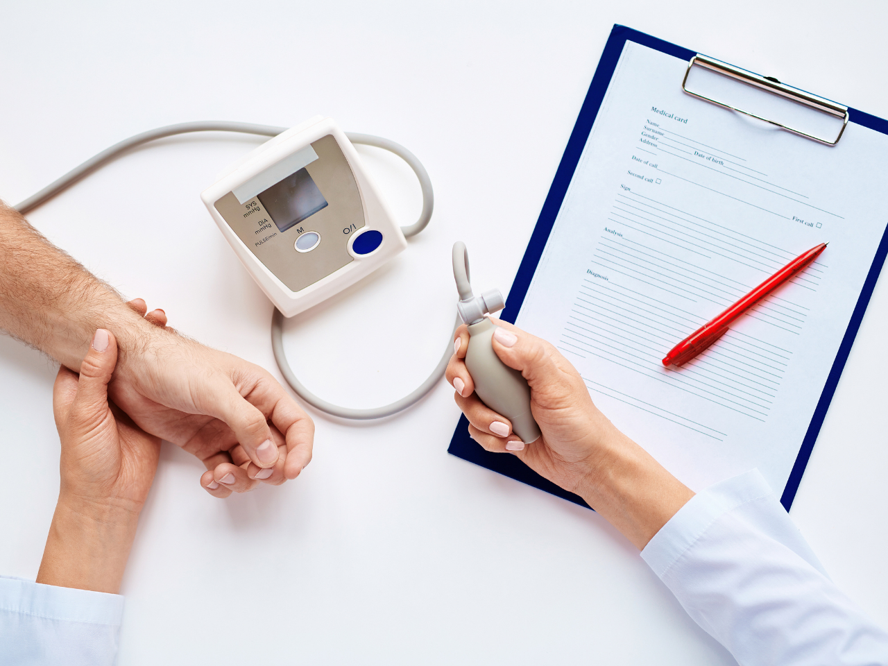

A saúde do trabalhador é um dos aspectos levados em consideração na hora da contratação de um profissional e também no decorrer de seu exercício. É importante garantir que o funcionário tenha condições de saúde para exercer suas atividades e evitar que sua saúde seja danificada devido ao trabalho.

Para isso, existem os exames ocupacionais, que são feitos antes do ingresso do trabalhador na empresa, durante o exercício do trabalho e após a demissão.

Alguns desses exames são obrigatórios e fundamentais, tanto para a empresa quanto para o trabalhador. E no #BlogHBit desta semana, te falamos sobre a importância dos exames ocupacionais. Mas, primeiro, quais são esses tipos de exames?

## Tipos de exames ocupacionais

Existem diversos tipos de exames ocupacionais. Entre eles, os que são obrigatórios por lei estão listados abaixo. Confira!

### Exame admissional

O exame admissional é realizado antes que o trabalhador assuma suas atividades. Geralmente consiste em uma entrevista sobre o estado físico e mental do novo contratado.

Nessa entrevista, o histórico de doenças é investigado, e a pressão arterial, os batimentos cardíacos, o peso e altura do profissional são medidos.

### Exame periódico

O exame periódico tem a finalidade de investigar se houve alguma alteração na saúde do trabalhador. Essa análise pode evitar o surgimento de sintomas mais graves e facilita o encaminhamento a um especialista.

A periodicidade do exame pode variar, de acordo com o quadro de saúde e atividade do colaborador. Para os portadores de doenças crônicas, os exames devem ser repetidos a cada um ano ou menos, enquanto para os profissionais expostos a riscos, o ideal é que as entrevistas sejam feitas a cada seis meses.

### Exame de retorno ao trabalho

Esse tipo de exame deve ser feito quando o trabalhador retorna ao trabalho após um período de afastamento igual ou superior a 30 dias devido a acidente ou doença, sejam eles ocupacionais ou não.

### Mudança de função

Esse exame deve ser realizado quando o profissional passa por uma mudança de função, setor ou atividade. É muito importante para os casos em que a mudança aumenta a exposição a algum risco.
Exame demissional

O exame demissional deve ser feito para avaliar a saúde do funcionário que está sendo demitido e verificar se houve algum dano decorrente da execução de seu trabalho. É obrigatório e deve ser feito 15 dias antes do desligamento.

Custo dos exames

O custo dos exames ocupacionais é de responsabilidade do contratante. O valor do exame admissional, por exemplo, não costuma ser alto. Geralmente, o preço nas clínicas costuma variar de R$ 20,00 a R$50,00. Já o preço dos exames periódicos pode variar mais.

Para otimizar esse tipo de gasto, é interessante ter um médico do trabalho no quadro de pessoal. Assim, os exames ocupacionais podem ser feitos no próprio ambiente de trabalho, evitando despesas adicionais.

## A importância dos exames ocupacionais

Os exames médicos ocupacionais são importantes tanto para o contratante quanto para o funcionário, uma vez que servem de proteção para os dois na garantia de seus direitos. Realizar esses exames é fundamental para saber se o profissional possui condições para exercer suas atividades. Além disso, eles são importantes para preservar a saúde do trabalhador e prevenir o surgimento de doenças ocupacionais.

A partir desses exames é possível orientar os trabalhadores quanto aos fatores de risco a que estão expostos em seu ambiente de trabalho. **Eles permitem também identificar antecipadamente alguma condição que possa impedir o trabalhador de exercer sua função.**

Para o trabalhador, os exames ocupacionais servem como garantia, pois ele poderá ser indenizado se adquirir alguma doença em decorrência do trabalho. Para o empregador, eles são importantes porque a preocupação com a saúde ocupacional reduz os índices de [absenteísmo](https://blog.healthbit.com.br/saiba-tudo-sobre-absentismo-como-rh-pode-ajudar) motivado por doenças e evita acidentes de trabalho.

Ainda, pode garantir funcionários mais adequados ao cargo e, consequentemente, com um melhor desempenho. Além disso, não realizar adequadamente os exames pode resultar em implicações legais, uma vez que alguns deles são obrigatórios por lei.

Estar atento à saúde organizacional é fundamental e pode trazer muitos benefícios para a empresa. Garantir um [ambiente de trabalho saudável](https://blog.healthbit.com.br/medicina-preventiva-o-segredo-da-seguranca-e-saude-do-trabalhador) é muito importante e os exames ocupacionais contribuem para isso.

Quer saber mais? Fique atento ao #BlogHBit e nossas redes sociais! 