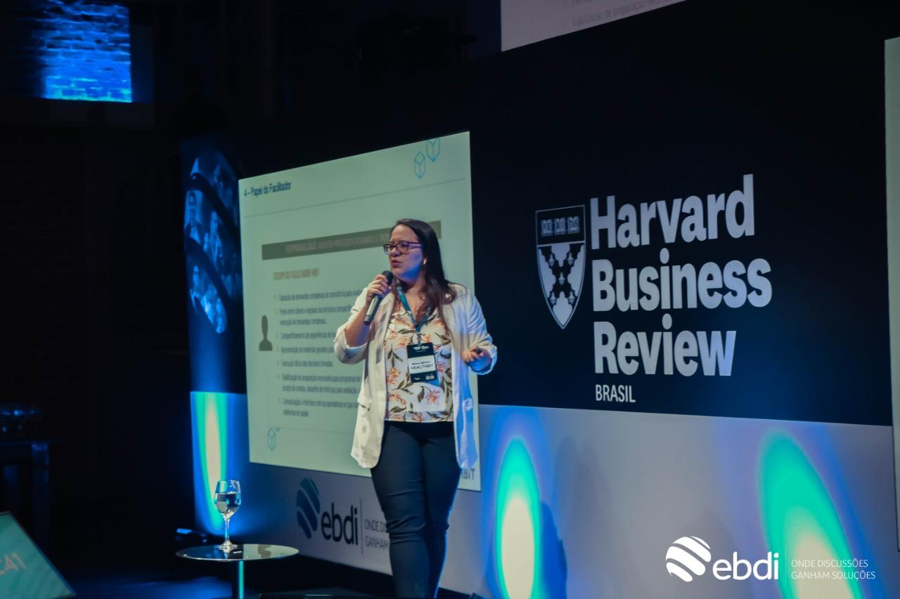

O dia 8 de março foi institucionalizado pela Organização das Nações Unidas (ONU) como o Dia Internacional da Mulher. Este é um dia marcado e lembrado pelas manifestações das mulheres nos séculos XIX e XX pelos seus direitos trabalhistas. Mas qual a importância da data para a sua empresa?

A data por si só já é importante para falar sobre a luta das mulheres, principalmente no mercado de trabalho. E esta luta continua muito importante até hoje: segundo o IBGE, enquanto **os profissionais do sexo masculino receberam R$ 2.555,00, as mulheres ganharam R$ 1.985,00**.

Os números não mentem: um estudo realizado pelo Instituto de Pesquisa Econômica Aplicada (Ipea) identificou que **o número de mulheres que trabalham cai de 60,2%, em um ano antes da gravidez, para 45,4% nos primeiros seis meses de vida do bebê**. E uma pesquisa da Fundação Getúlio Vargas aponta que **metade das profissionais que se tornam mães são demitidas até dois anos depois do fim da licença maternidade**.

Decidimos abordar o assunto aqui no #BlogHBit para te mostrar a importância do Dia Internacional da Mulher na sua organização e quais ações podem ser feitas neste dia e mês.

## Importância da igualdade de gênero e do Dia Internacional da Mulher nas empresas

A igualdade de gênero ajuda o mundo como um todo: de acordo com um [estudo feito pela União Europeia](https://eige.europa.eu/news/gender-equality-boosts-economic-growth), as **melhorias na igualdade de gênero gerarão até 10,5 milhões de empregos adicionais nos países até 2050 e a taxa de emprego na União Européia alcançaria quase 80%**.

E nas empresas, a igualdade de gênero pode trazer inúmeros benefícios, inclusive, econômicos. O [relatório “Mulheres na gestão empresarial: argumentos para uma mudança”, feito pela Organização Internacional do Trabalho (OIT)](https://valorinveste.globo.com/mercados/brasil-e-politica/noticia/2019/05/22/mulher-no-comando-de-empresas-da-mais-lucro-no-brasil-diz-oit.ghtml), afirma que **quase três entre quatro das empresas que promovem a diversidade de gênero em cargos diretivos dizem ter obtido aumento dos lucros de 5% a 20%**.

E agora que entendemos a importância da igualdade de gênero nas empresas, já podemos imaginar a importância de se celebrar o Dia Internacional da Mulher dentro da organização, certo?

Mais do que dizer a importância que as mulheres têm nos resultados e na empresa como um todo, **é mostrar que se valoriza os trabalhos delas** e, dependendo da forma como é celebrado, mostrar o quanto a organização está envolvida na luta pela igualdade de gênero.

Pensando nisso também, quais ações podem ser realizadas na empresa que mostram o envolvimento com essa igualdade e que, também, fuja de clichês.

## Ações que podem ser realizadas na organização

### Presentes realmente úteis

Que tal neste ano fugir da tradicional flor e chocolate e pensar em algo que realmente faça a diferença na vida das suas colaboradoras? Pense em um caderno personalizado para o dia, um livro (ou vale-presente para comprar livros) e até, quem sabe, **um curso para que ela possa aprimorar seus conhecimentos**.

**Fuja do óbvio e se questione o que realmente as mulheres da sua empresa gostariam de ganhar e que faria diferença no dia-a-dia delas.**

### Reconheça o trabalho de cada uma (e da empresa como um todo!)

Sabe os recadinhos de Dia Internacional da Mulher? Que tal fazê-los personalizados, com elogios e feedbacks positivos que realmente dizem respeito a cada pessoa - e não uma coisa geral e igual para todas.

E caso a sua empresa tenha um trabalho e uma conduta focada para promover a igualdade de gênero, que tal buscar reconhecer isso? **A HealthBit, atualmente, tem metade (50%) da sua liderança composta por mulheres e elas representam 59,67% da empresa**.

Além disso, a **HealthBit é reconhecida internacionalmente pela [The Women’s Empowerment Principles (WEPs)](https://www.weps.org/), uma organização em parceria com a ONU Mulheres que busca igualdade de gênero e incentiva empresas a promover o empoderamento das mulheres no local de trabalho, mercado e comunidade**.

A WEPs oferece princípios que foram estabelecidos pelo Pacto Global da ONU e pela ONU Mulheres. São 7 princípios que foram elaborados pelos padrões internacionais de trabalho e direitos humanos e as empresas reconhecidas têm participação e são responsáveis ​​pela igualdade de gênero e pelo empoderamento das mulheres.

Buscar reconhecimentos de organizações que promovem e incentivam a igualdade de gênero é uma ótima forma de mostrar que, além de falar, a sua empresa realmente promove essa igualdade.

### Faça rodas de conversa só para as mulheres

Cada mulher, por mais que tenham experiências similares, viveram de formas diferentes. Por isso, é sempre muito importante promover um local de fala e troca desses momentos.

Falar sobre o cansaço e carga mental de se ser mulher, além das expectativas irreais acima delas pode ser ótimo para aliviar a tensão.

### Faça palestras sobre temas variados - e que as ajude

Alguns temas de palestras podem ajudar muito as mulheres no dia a dia, como aquelas sobre empoderamento, gestão de tempo, cuidados com a saúde, entre outras.

Então, **que tal fazer com que esse dia tenha também um momento de conhecimento e aprendizado? A HealthBit neste mês de março, estamos oferecendo algumas palestras para inspirar e trazer autoconhecimento para suas funcionárias**. Com duração de 1 hora, e feitas de forma virtual, por vídeo chamadas, através do Google Meet ou Microsoft Teams, os temas são:

- Empoderamento Feminino e Gestão de Tempo;
- Violência contra a mulher;
- Sexualidade sem tabu;
- Experimente uma vida mais leve;
- Inteligência Emocional

Caso queira saber mais sobre as palestras, entre em contato conosco pelo e-mail comunicacao@healthbit.com.br

E na sua empresa, quais ações de Dia Internacional da Mulher serão feitas? Conte para a gente nas nossas redes sociais! 