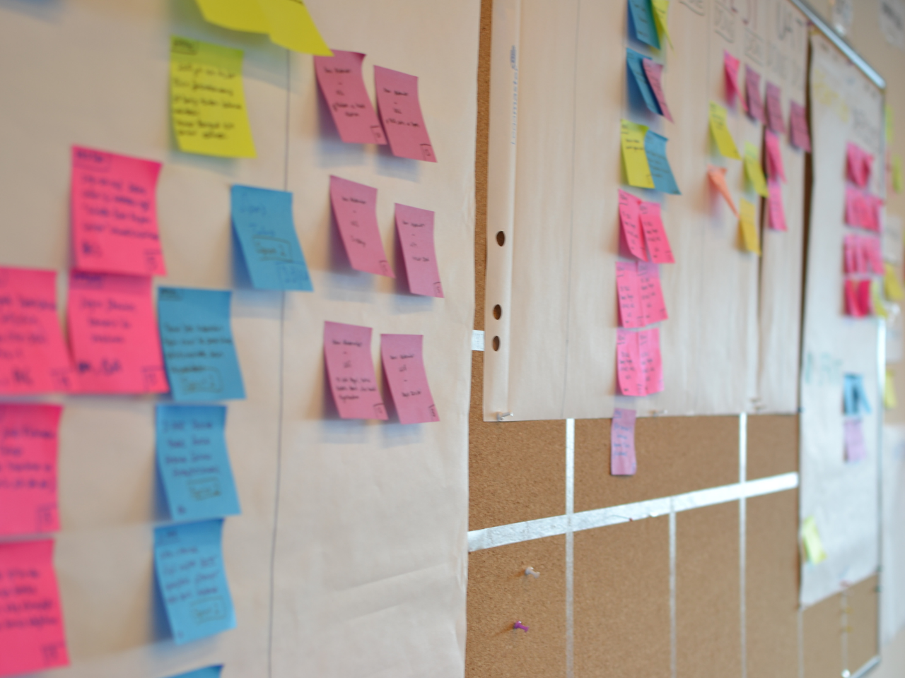

Pode ser que você já tenha ouvido falar de metodologia ágil por aí, afinal é um tema cada vez mais em evidência e requisitado nas empresas, por se mostrar um modo de gestão inovador e eficiente.

Neste texto, nos juntamos à Caiena, [empresa em tecnologia e design](http://caiena.net/), para apresentarmos a origem do termo e como a metodologia ágil pode ser uma ótima alternativa na gestão de projetos.

## O que é metodologia ágil?

Para contar a história desde o início, é preciso voltar ao [Manifesto Ágil](https://blog.caiena.net/o-que-e-o-manifesto-agil/): uma declaração feita pelos criadores da metodologia, com o intuito de declarar os valores que a compõem. Em um trecho do manifesto, apresentam: “pessoas em vez de processos; produtos que realmente funcionem em vez de documentação dizendo como o produto deveria funcionar; trabalhar com os clientes em vez de negociar com eles; e responder às mudanças em vez de seguir um plano”.

Um dos criadores do manifesto, Jeff Sutherland, conta que na metodologia ágil se prioriza “uma estrutura em volta do processo de aprendizagem, permitindo que as equipes avaliem o que já criaram e, o mais importante, de que forma o criaram”. Esse trecho encontra-se em seu livro “Scrum: A arte de fazer o dobro do trabalho na metade do tempo”, onde relata suas experiências no desenvolvimento de software antes e depois dessa inovação.

A metodologia ágil **leva em consideração a imprevisibilidade da vida**, ou seja, os projetos são divididos em ciclos curtos, que permitem o controle das ações em cada etapa, assim como as mudanças no curso sempre que necessário.

A cada ciclo cria-se e testa-se uma parte do projeto, **aquela que a equipe e o cliente entendem ser a que tem mais valor no momento**. Por sua dinâmica, os ciclos permitem que **o cliente e a equipe reavaliem, juntos, a importância e a direção do projeto**.

A metodologia ágil foi criada, principalmente, para contrapor uma outra forma de gestão chamada "modelo cascata", predominante até então. Nesse modelo, as equipes passavam meses trabalhando em um projeto e só o apresentavam ao final do desenvolvimento, já totalmente pronto.

No contexto de projetos longos, isso impactava em problemas que apareciam quando o cliente, ao ver o projeto pronto, percebiam que não era bem isso que queriam – seja porque o contexto mudou e o produto criado já não atendia às expectativas, seja porque as vontades mudaram. Como resultado, ocorriam gastos desnecessários e o retrabalho, além da frustração em ambas as equipes – tanto a do cliente, quanto a do projeto.

Em contrapartida, o método ágil propôs conceitos de aprimoramento contínuo e da entrega de um produto minimamente viável (ou MVP – Minimum Viable Product) para obter feedbacks imediatos de consumidores ao final de cada ciclo, em vez de esperar até que o projeto esteja concluído. Ou seja, **esse processo de manter a comunicação e as entregas constantes se mostrou e, até hoje, se mostra capaz de agilizar a entrega do produto final, além de otimizar sua qualidade**. A metodologia ágil pode ser, então, uma alternativa capaz de impactar positivamente os projetos!

Apesar de ter sido criada pela indústria de desenvolvimento de software, a **metodologia ágil tem se mostrado eficiente em diversos segmentos**. Além disso, existem [vários tipos de metodologias ágeis](https://blog.caiena.net/scrum-kanban-metodologias-ageis-forma-de-trabalhar/), como: Scrum, Lean e Agile Framework – é possível **escolher a que melhor se adapte ao seu produto ou negócio**.

## Pequeno glossário da metodologia ágil:

A metodologia ágil traz consigo diversos termos específicos para suas cerimônias e elementos. No entanto, aqui apresentaremos apenas alguns deles, que em geral podem ser utilizados em projetos de diversas áreas, não apenas de desenvolvimento.

- Backlog: é a lista das tarefas necessárias para a entrega de um produto, e contém suas técnicas de organização e priorização. Ele é composto por um histórico de atividades, das funcionalidades, melhorias e aprendizados obtidos durante o desenvolvimento.
- Sprint: é o nome dado para os ciclos que acontecem durante o projeto.
- Product Owner: é a pessoa responsável por transformar as necessidades do cliente em tarefas para equipe técnica. O papel do P.O. é muito importante, pois é quem exerce a liderança da gestão dos projetos.
- Test Driven Development (TDD): o desenvolvimento orientado por testes diz respeito a criação de um código simples voltado ao teste antes de programar a real implementação.

## A importância da metodologia ágil em momentos de crise

A metodologia ágil é capaz de oferecer uma dinâmica de melhoria contínua conectada, justamente, às **mudanças de cenário**. Para garantir o andamento dos projetos, mesmo diante das mudanças, é preciso que os métodos sejam aplicados de forma adaptada à realidade do cliente e do contexto, mantendo-se o essencial: **agilidade no planejamento, melhoria contínua e a entrega de valor para as pessoas envolvidas e impactadas ao longo de todo o projeto**.

Por isso, a metodologia ágil pode ser utilizada em momentos desafiadores, em que se necessita da resolução rápida de um problema. Na **área da saúde**, por exemplo, a **metodologia ágil pode promover benefícios na gestão dos estoques, no atendimento ao paciente e na resolução de falhas por meio do feedback constante**.

Durante a pandemia de COVID-19 o [governo do estado de São Paulo adotou a metodologia ágil](https://exame.com/carreira/a-metodologia-agil-serve-para-um-governo-a-experiencia-de-sp-diz-que-sim/) e equipes multidisciplinares no processo de tomadas de decisão. Até a [fabricação de vacinas para COVID-19](https://www.mundodomarketing.com.br/canais/editorial/39021/como-a-vacina-para-covid-19-nos-ensina-sobre-o-metodo-agile.html), feitas pela Oxford, foi antecipada com a prática do método ágil.

É notável como a metodologia ágil é capaz de gerar impacto na gestão de projetos de diversas áreas. E se você se lembra de outro exemplo da aplicação da metodologia ágil, nos conte nas nossas redes sociais!
